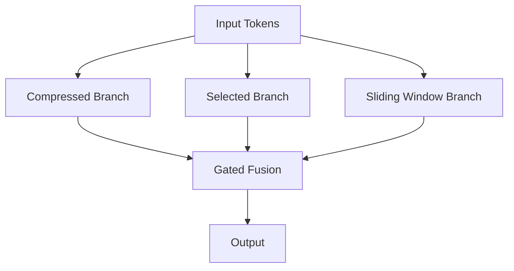

This post starts from the basics of Full Attention, breaks down the Sparse and Linear escape routes, and follows them all the way to DeepSeek's NSA (Native Sparse Attention) and Gated Linear Attention (GLA). For each mechanism, I'll cover the math, computational complexity, engineering tradeoffs, and real-world deployment performance.

## 1. Standard Full Attention

Scaled Dot-Product Attention is where everything starts:

$$
\text{Attention}(Q, K, V) = \text{softmax}\left(\frac{QK^T}{\sqrt{d_k}}\right) V
$$

Where:
- $Q \in \mathbb{R}^{N \times d_k}$, $K \in \mathbb{R}^{N \times d_k}$, $V \in \mathbb{R}^{N \times d_v}$
- $N$ is the sequence length, $d_k$ is the key dimension

**Complexity Analysis:**

| Dimension | Complexity |
|-----------|-----------|
| Time complexity | $O(N^2 d)$ |
| Space complexity (attention matrix) | $O(N^2)$ |
| KV Cache (inference) | $O(N \cdot d)$ per layer |

> **The core problem:** $O(N^2)$ means doubling the sequence length quadruples the compute. At 128K or 1M tokens, this quadratic cost becomes unbearable.

Multi-Head Attention splits $d_{model}$ into $h$ heads, each performing independent attention before concatenation:

$$
\text{MultiHead}(Q, K, V) = \text{Concat}(\text{head}_1, \dots, \text{head}_h) W^O
$$

$$
\text{head}_i = \text{Attention}(Q W_i^Q, K W_i^K, V W_i^V)
$$

Where $W_i^Q \in \mathbb{R}^{d_{model} \times d_k}$, $W_i^K \in \mathbb{R}^{d_{model} \times d_k}$, $W_i^V \in \mathbb{R}^{d_{model} \times d_v}$, $W^O \in \mathbb{R}^{h d_v \times d_{model}}$.

## 2. Two Escape Routes: Sparse vs Linear

Faced with $O(N^2)$, the community has taken two fundamentally different paths:

| Dimension | Sparse Attention | Linear Attention |
|-----------|-----------------|-----------------|
| Core idea | Compute only selected token pairs | Use kernel functions to bypass softmax |
| Attention matrix | Sparse $N \times N$ | Never explicitly constructed |
| Time complexity | $O(N \sqrt{N})$ to $O(N \log N)$ | $O(N d^2)$ |
| Information loss | Only sees partial tokens | No explicit forgetting |
| Representative work | Longformer, BigBird, NSA | Linear Transformer, GLA, RetNet |
| Hardware friendliness | Medium (irregular sparse access) | High (matrix multiply dominant) |
| Long context performance | Depends on sparsity pattern design | Theoretically good, needs forget gates in practice |

> **Sparse or Linear?** It's not either/or. DeepSeek's NSA proved that hybrid approaches (Sparse + compression + sliding window) yield the best engineering tradeoffs. GLA proved that Linear Attention with forget gates can replace Full Attention in specific scenarios.

## 3. Sparse Attention

### 3.1 Basic Sparsity Patterns

The core idea behind Sparse Attention: not every token needs to attend to every other token. Keep only the "important" token pairs, turning the attention matrix from dense to sparse.

**Sliding Window**

Each token only attends to $w$ neighboring tokens:

$$
A_{ij} = \begin{cases} \text{softmax}(q_i k_j^T / \sqrt{d_k}) & \text{if } |i - j| \leq w \\ 0 & \text{otherwise} \end{cases}
$$

- Complexity: $O(Nw)$, linear in $N$
- Problem: purely local, cannot capture long-range dependencies

**Global Tokens**

Select a few tokens (e.g., [CLS], segment starters) that can attend to all positions and be attended to by all positions:

$$
\text{GlobalSet} = \{t_1, t_2, \dots, t_g\}, \quad g \ll N
$$

- Number of global tokens $g$ is typically $O(\sqrt{N})$ or a fixed constant
- Provides information aggregation points for the entire sequence

**Random Connections**

Randomly select token pairs to keep connections. The theoretical basis is the small-world property of random graphs — any two nodes can be connected through very few hops.

### 3.2 Longformer & BigBird

**Longformer** combines three patterns:

1. Sliding window (local) — present in every layer
2. Dilated sliding window — sampled at intervals, expands receptive field
3. Global attention — task-relevant tokens marked as global

Complexity drops from $O(N^2)$ to $O(Nw)$, where $w$ is the window size.

**BigBird** adds random attention on top of Longformer:

$$
\text{BigBird} = \text{Sliding Window} + \text{Global Tokens} + \text{Random Connections}
$$

Theoretical proof: BigBird's sparse attention pattern is Turing complete and a universal approximator of sequence-to-sequence functions.

### 3.3 Engineering Challenges of Sparse Attention

Sparsity patterns look great in theory, but present several hard engineering problems:

> **Hardware unfriendly:** GPU Tensor Cores are optimized for dense matrix multiplication. Sparse attention patterns mean irregular memory access, making it hard to utilize full hardware bandwidth. FlashAttention's block-sparse variant is the best compromise so far, but still requires sparsity patterns aligned at the block level.

- Sparsity patterns need to be determined at compile/initialization time; dynamic sparsity is harder to optimize
- Different layers may need different sparsity patterns
- Inference KV Cache is still $O(N)$ — sparsity helps compute but not storage

## 4. Linear Attention

### 4.1 The Kernel Trick

The bottleneck in standard Attention is softmax — it forces computing $QK^T$ (an $N \times N$ matrix) before normalization. Linear Attention uses kernel functions to bypass this step.

Let $\phi: \mathbb{R}^d \to \mathbb{R}^D$ be a feature map satisfying:

$$
\text{sim}(q, k) = \phi(q)^T \phi(k) \approx \exp(q^T k / \sqrt{d_k})
$$

Then attention can be rewritten as:

$$
o_i = \frac{\sum_{j=1}^{N} \phi(q_i)^T \phi(k_j) \cdot v_j}{\sum_{j=1}^{N} \phi(q_i)^T \phi(k_j)}
$$

### 4.2 Computation Order Magic

The key is associativity of matrix multiplication. The formula above computed as $(QK^T)V$ costs $O(N^2 d)$. But if we compute $K^T V$ first:

$$
o_i = \frac{\phi(q_i)^T \left(\sum_{j=1}^{N} \phi(k_j) v_j^T\right)}{\phi(q_i)^T \left(\sum_{j=1}^{N} \phi(k_j)\right)}
$$

Let $S = \sum_{j=1}^{N} \phi(k_j) v_j^T \in \mathbb{R}^{D \times d_v}$, $z = \sum_{j=1}^{N} \phi(k_j) \in \mathbb{R}^{D}$, then:

$$
o_i = \frac{\phi(q_i)^T S}{\phi(q_i)^T z}
$$

- Computing $S$ and $z$: $O(N D d_v)$
- Computing each $o_i$: $O(D d_v)$
- Total complexity: $O(N D d_v) = O(N d^2)$ (when $D = O(d)$)

> **From $O(N^2 d)$ to $O(N d^2)$:** When $N \gg d$ (long sequences), this is a qualitative leap. For a 128K sequence with $d=128$, that's roughly $N^2 / d \approx 128K$ times speedup.

### 4.3 RNN Equivalence

Linear Attention has an elegant RNN equivalent form:

$$
S_t = S_{t-1} + \phi(k_t) v_t^T
$$

$$
z_t = z_{t-1} + \phi(k_t)
$$

$$
o_t = \frac{\phi(q_t)^T S_t}{\phi(q_t)^T z_t}
$$

- $S_t \in \mathbb{R}^{D \times d_v}$ is the "state matrix" — a compressed version of the KV Cache
- During inference, only $S_t$ and $z_t$ need to be maintained, with space complexity $O(Dd_v)$ independent of sequence length
- This means Linear Attention models can do constant-memory inference like RNNs

### 4.4 The Fatal Flaw: Never Forgetting

The RNN form reveals a fatal problem: $S_t = S_{t-1} + \phi(k_t) v_t^T$.

Information only accumulates, never decays. As the sequence grows:
- $S_t$ gets "drowned" by ever-growing historical information
- New token signals get diluted
- Practical outcome: quality degrades sharply beyond a certain sequence length

> **This is why pure Linear Attention underperforms Full Attention in practice.** Subsequent improvements (RetNet, GLA, Mamba) are all fundamentally solving this forgetting problem.

## 5. DeepSeek NSA (Native Sparse Attention)

DeepSeek's NSA is one of the best-engineered Sparse Attention implementations to date. It's not a new academic idea — it combines existing sparse patterns in a hardware-aware manner.

### 5.1 Three-Branch Architecture

NSA's core design uses three parallel branches:



**Branch 1: Compressed Attention**

Groups contiguous tokens into blocks, compressing each block into a representative token:

$$
\tilde{k}_m = \text{MLP}_k\left(\text{concat}(k_{(m-1)l+1}, \dots, k_{ml})\right)
$$

$$
\tilde{v}_m = \text{MLP}_v\left(\text{concat}(v_{(m-1)l+1}, \dots, v_{ml})\right)
$$

Where $l$ is the block size (e.g., 32), $m$ is the block index. Sequence length drops from $N$ to $N/l$.

- Purpose: capture coarse-grained global information
- Complexity: $O(N \cdot N/l \cdot d) = O(N^2 d / l)$

**Branch 2: Selected Attention**

Uses Compressed Attention scores to select the Top-$p$ important token blocks, then runs full attention only on those blocks:

$$
\text{TopBlocks} = \text{argtop}_p\left(\sum_{i \in \text{block}_m} A_{compressed}(q, \tilde{k}_m)\right)
$$

- Purpose: fine-grained attention on critical positions
- Complexity: $O(N \cdot p \cdot l \cdot d)$, where $p \ll N/l$

**Branch 3: Sliding Window Attention**

Standard sliding window with window size $w$:

- Purpose: capture local context
- Complexity: $O(Nw d)$

### 5.2 Gated Fusion

Outputs from the three branches are mixed via sigmoid gating:

$$
o = g_1 \cdot o_{compressed} + g_2 \cdot o_{selected} + g_3 \cdot o_{sliding}
$$

$$
g_1, g_2, g_3 = \sigma(W_g \cdot q + b_g)
$$

Gating is query-dependent: different queries can learn different branch preferences.

### 5.3 Hardware-Aligned Design

A key design decision in NSA: **all operations work on contiguous blocks**:

- Compressed branch: block-wise MLP
- Selected branch: selects contiguous blocks, not scattered tokens
- Sliding window: naturally contiguous

> **Why does this matter?** Data transfer efficiency from GPU HBM to SRAM depends on contiguity. FlashAttention already proved that block-wise computation avoids $O(N^2)$ memory usage. All NSA branches naturally fit block-wise kernels without special memory layouts for sparsity patterns.

### 5.4 Performance Numbers

DeepSeek's reported numbers (27B model, 64K context):

| Metric | Full Attention | NSA |
|--------|---------------|-----|
| Training speed | 1x | ~1.6x |
| Inference latency (64K context) | 1x | ~3x faster |
| Needle-in-a-Haystack | 97.5% | 97.2% |
| Long-text perplexity | baseline | near baseline |

Key observations:
- Quality is nearly lossless
- Training also gets a speedup (total compute across three branches < full $N^2$)
- Inference speedup is larger (KV Cache can store only compressed + sliding window)

## 6. GLA (Gated Linear Attention)

GLA's core contribution: adding a forget gate to Linear Attention, solving the "never forgetting" fatal flaw.

### 6.1 The Forget Gate

Recall Linear Attention's RNN form: $S_t = S_{t-1} + \phi(k_t) v_t^T$. GLA adds a forget gate $\alpha_t \in (0, 1)^{d \times d}$ (simplified to diagonal $\text{diag}(\alpha_t)$):

$$
S_t = \text{diag}(\alpha_t) \cdot S_{t-1} + k_t v_t^T
$$

$$
o_t = q_t^T S_t
$$

When $\alpha_t = 1$, it degrades to standard Linear Attention; when $\alpha_t < 1$, historical information decays exponentially.

$\alpha_t$ is data-dependent:

$$
\alpha_t = \sigma(W_\alpha x_t + b_\alpha)
$$

The model can learn different forgetting rates for different types of tokens.

### 6.2 Chunk-wise Parallel Training

GLA's RNN form is good for inference but bad for training (serial). The paper proposes a chunk-wise parallel algorithm:

1. Split the sequence into chunks of size $C$
2. Within each chunk, use parallel matrix multiplication (similar to Full Attention)
3. Between chunks, use RNN recurrence (passing $S$ state)

```python
# Pseudocode: GLA chunk-wise training
def gla_chunk_forward(Q, K, V, alpha, chunk_size=64):
    N = Q.shape[1]
    S = torch.zeros(batch, d, d_v)  # state matrix
    outputs = []

    for i in range(0, N, chunk_size):
        q = Q[:, i:i+chunk_size]  # (B, C, d)
        k = K[:, i:i+chunk_size]  # (B, C, d)
        v = V[:, i:i+chunk_size]  # (B, C, d_v)
        a = alpha[:, i:i+chunk_size]  # (B, C, d)

        # Intra-chunk: parallel attention computation
        # Construct intra-chunk decay matrix
        decay = compute_intra_chunk_decay(a)  # (B, C, C)
        intra = (q @ k.transpose(-1, -2)) * decay  # (B, C, C)
        o_intra = intra @ v  # (B, C, d_v)

        # Inter-chunk: read historical info from S
        chunk_decay = compute_chunk_decay(a)  # (B, d)
        o_inter = q @ (chunk_decay.unsqueeze(-1) * S)  # (B, C, d_v)

        # Combine
        o = o_intra + o_inter
        outputs.append(o)

        # Update state S
        S = update_state(S, k, v, a)

    return torch.cat(outputs, dim=1)
```

Training complexity: $O(NC^2 + N d^2)$, where $C$ is chunk size, typically 64-256. When $C \ll N$, this approaches linear.

### 6.3 The GLA Family

| Model | Forget Gate | State Size | Training Parallelism | Year |
|-------|------------|-----------|---------------------|------|
| Linear Transformer | None | $d \times d_v$ | Fully parallel | 2020 |
| RetNet | Fixed decay $\gamma^{t-s}$ | $d \times d_v$ | Chunk-wise | 2023 |
| GLA | Data-dependent $\alpha_t$ | $d \times d_v$ | Chunk-wise | 2024 |
| Mamba (S6) | Data-dependent | $d \times N_{state}$ | Scan | 2024 |
| Mamba2 | Data-dependent | $d \times d_v$ | Chunk-wise | 2024 |

> **Trend:** From fixed decay to data-dependent forget gates, from pure RNN training to chunk-wise parallelism, the Linear Attention family is gradually approaching the ideal of "train like a Transformer, infer like an RNN."

### 6.4 Deployment in Qwen3-Coder-Next

Qwen3-Coder-Next uses a hybrid architecture:

- Some layers use Full Attention (ensuring global information flow)
- Other layers use GLA (reducing inference KV Cache pressure)
- Interleaved arrangement, typical ratio around 1:3 (1 Full + 3 GLA per 4 layers)

Engineering implications:
- KV Cache reduced significantly (GLA layers only maintain a $d \times d_v$ state matrix, not full KV cache)
- Faster inference (GLA layers compute $O(d^2)$ per token, independent of context length)
- Training speed close to pure Transformer (chunk-wise parallel training ensures GPU utilization)

## 7. Full Comparison

| Mechanism | Time Complexity | Space Complexity | Long-Context Quality | Inference KV Cache | Hardware Friendliness | Training Difficulty |
|-----------|----------------|-----------------|---------------------|-------------------|---------------------|-------------------|
| Full Attention | $O(N^2 d)$ | $O(N^2)$ | Best | $O(Nd)$ per layer | High (FlashAttn) | Simple |
| Longformer | $O(Nw)$ | $O(Nw)$ | Good | $O(Nd)$ | Medium | Simple |
| BigBird | $O(N(w+g+r))$ | $O(N(w+g+r))$ | Good | $O(Nd)$ | Medium | Simple |
| NSA | $O(N \cdot (N/l + pl + w))$ | $O(N)$ | Near Full | $O(N/l \cdot d + wd)$ | High (block-wise) | Medium |
| Linear Attention | $O(Nd^2)$ | $O(d^2)$ | Poor (no forgetting) | $O(d^2)$ | High | Simple |
| GLA | $O(NC^2 + Nd^2)$ | $O(d^2)$ | Good | $O(d^2)$ | High | Medium |
| Mamba2 | $O(NC^2 + Nd^2)$ | $O(d^2)$ | Good | $O(d^2)$ | High | Medium |

## 8. Architecture Evolution

```mermaid
graph LR
    FA[Full Attention<br/>O&#40;N²&#41;] --> S[Sparse Route]
    FA --> L[Linear Route]

    S --> SW[Sliding Window]
    S --> GT[Global Tokens]
    S --> RC[Random Connections]
    SW --> LF[Longformer]
    GT --> LF
    GT --> BB[BigBird]
    RC --> BB
    SW --> NSA[DeepSeek NSA]

    L --> LT[Linear Transformer]
    L --> RN[RetNet]
    LT --> GLA_node[GLA]
    RN --> GLA_node
    L --> Ma[Mamba / S6]
    Ma --> Ma2[Mamba2]
    GLA_node --> Hy[Hybrid Models<br/>Qwen3-Coder-Next]
    NSA --> Hy
```



## 9. Engineering Takeaways

**The most important conclusions for kernel engineers:**

1. **FlashAttention is the ultimate optimization for Full Attention, but it doesn't change the $O(N^2)$ fundamental.** It reduces memory from $O(N^2)$ to $O(N)$, but computation stays the same. Long-context scenarios still need Sparse or Linear.

2. **NSA's three-branch design naturally fits block-wise kernels.** Compressed branch is block reduce + MLP, selected branch is block gather + FlashAttention, sliding window is standard FlashAttention's window variant. All three can be implemented with existing efficient kernels.

3. **GLA's chunk-wise training is essentially "small FlashAttention + RNN recurrence."** The intra-chunk attention matrix is $C \times C$ (e.g., $64 \times 64$), which fits entirely in SRAM. Inter-chunk state transfer is matrix multiplication, perfect for Tensor Cores.

4. **Hybrid architectures (Full + GLA/Mamba) are the current engineering optimum.** Use a few Full Attention layers to ensure information completeness, and many Linear layers to reduce inference cost. Kernel development for these architectures needs to support both attention modes.

5. **AMD MI300X/MI355X deployment considerations:**
   - FlashAttention: CK has highly optimized implementations
   - NSA: Needs custom kernels (block-wise compression + selection)
   - GLA: Triton for ROCm can write chunk-wise training kernels, but inference kernels need hand-written CK for optimal performance
   - Hybrid dispatch: inference engines need to dynamically select kernel paths based on layer type

## References

- Vaswani et al., "Attention Is All You Need", NeurIPS 2017
- Beltagy et al., "Longformer: The Long-Document Transformer", 2020
- Zaheer et al., "Big Bird: Transformers for Longer Sequences", NeurIPS 2020
- Katharopoulos et al., "Transformers are RNNs: Fast Autoregressive Transformers with Linear Attention", ICML 2020
- Sun et al., "Retentive Network: A Successor to Transformer for Large Language Models", 2023
- Yang et al., "Gated Linear Attention Transformers with Hardware-Efficient Training", ICML 2024
- Gu & Dao, "Mamba: Linear-Time Sequence Modeling with Selective State Spaces", 2024
- Dao & Gu, "Transformers are SSMs: Generalized Models and Efficient Algorithms Through Structured State Space Duality", ICML 2024
- DeepSeek, "Native Sparse Attention: Hardware-Aligned and Natively Trainable Sparse Attention", 2025
