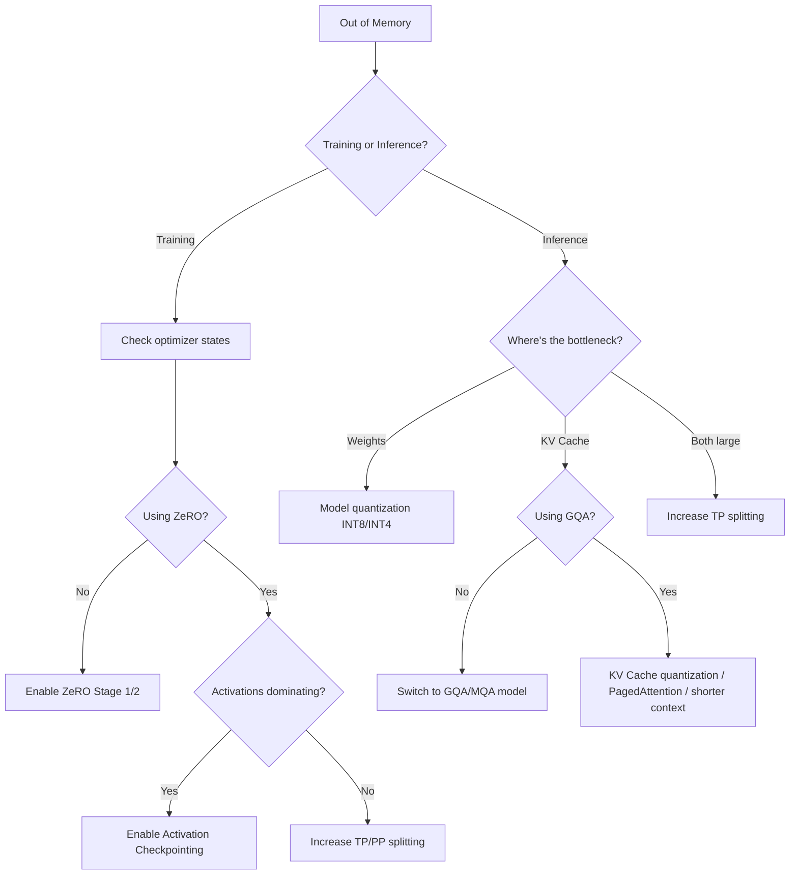

Figuring out how much GPU memory an LLM needs is a prerequisite before planning any training or inference setup. This post breaks down memory into its components, gives formulas for each, and shows how distributed strategies (DP, TP, PP, EP) split them across GPUs.

## 1. Six Components of GPU Memory

Training and inference use different memory components. Training uses all six; inference mainly uses model weights and KV Cache.

| Component | Symbol | Training | Inference |
|-----------|--------|----------|-----------|
| Model parameters | $M_{params}$ | Required | Required |
| Optimizer states | $M_{optim}$ | Required | None |
| Gradients | $M_{grad}$ | Required | None |
| Activations | $M_{act}$ | Required (can checkpoint) | Minimal |
| KV Cache | $M_{kv}$ | None | Required |
| Temporary buffers | $M_{buf}$ | Yes | Yes |

## 2. Base Variables

Let $P$ be the model parameter count (number of parameters), $b$ be bytes per parameter.

| Symbol | Meaning | Example |
|--------|---------|---------|
| $P$ | Parameter count | 7B = $7 \times 10^9$ |
| $b$ | Bytes per parameter | FP32=4, FP16/BF16=2, INT8=1, INT4=0.5 |
| $L$ | Transformer layers | 32 |
| $d$ | Hidden dimension | 4096 |
| $d_{ff}$ | FFN intermediate dimension | 11008 |
| $n_h$ | Attention head count | 32 |
| $n_{kv}$ | KV head count (GQA) | 8 |
| $V$ | Vocabulary size | 32000 |
| $N$ | Sequence length | 4096 |
| $B$ | Batch size | 32 |

## 3. Memory Formulas Per Component

### 3.1 Model Parameters

$$
M_{params} = P \times b
$$

| Model | Params | FP32 | FP16 | INT8 | INT4 |
|-------|--------|------|------|------|------|
| 7B | 7B | 28 GB | 14 GB | 7 GB | 3.5 GB |
| 13B | 13B | 52 GB | 26 GB | 13 GB | 6.5 GB |
| 70B | 70B | 280 GB | 140 GB | 70 GB | 35 GB |

### 3.2 Optimizer States (Training)

For AdamW, each parameter needs:
- First moment estimate $m$ (FP32)
- Second moment estimate $v$ (FP32)
- Master weight copy (if mixed precision, needs FP32 copy)

$$
M_{optim} = P \times (4 + 4 + 4) = 12P \quad \text{(mixed-precision AdamW)}
$$

For pure FP32 training:

$$
M_{optim} = P \times (4 + 4) = 8P \quad \text{(FP32 AdamW, weights already in } M_{params} \text{)}
$$

> **Mixed-precision training overhead:** A 7B model with mixed-precision AdamW requires $7B \times 12 = 84$ GB for optimizer states alone. This is why training a 7B model needs at least one 80GB A100/H100.

### 3.3 Gradients (Training)

Gradient per parameter, matching training precision:

$$
M_{grad} = P \times b_{grad}
$$

$b_{grad} = 2$ for FP16 training, $b_{grad} = 4$ for FP32 training.

### 3.4 Activations (Training)

Activations are intermediate results from the forward pass saved for backward. Rough estimate (without activation checkpointing):

$$
M_{act} \approx 2 \times B \times N \times d \times L \times b_{act}
$$

This is an approximation. The full formula including per-layer attention matrices ($O(BN^2n_h)$):

$$
M_{act} \approx L \times B \times N \times (34d + 5n_h N) \times b_{act}
$$

Where $34d$ comes from intermediate activations in each layer (Q, K, V, FFN intermediates, etc.), and $5n_h N$ comes from attention matrices (saved both pre- and post-softmax).

**Activation Checkpointing** significantly reduces $M_{act}$:

| Strategy | Activation Memory | Extra Compute |
|----------|------------------|---------------|
| None | $M_{act}$ | 0 |
| Per-layer checkpoint | $M_{act} / L$ | ~33% |
| Full recomputation | $O(B \times N \times d)$ | ~100% |

### 3.5 KV Cache (Inference)

$$
M_{kv} = 2 \times B \times N \times n_{kv} \times d_h \times L \times b_{kv}
$$

Where $d_h = d / n_h$.

With GQA (Grouped-Query Attention), $n_{kv} < n_h$, reducing KV Cache proportionally.

### 3.6 Temporary Buffers

NCCL communication buffers, CUDA workspace, etc. Typically about 1-2 GB, small relative to total but must be reserved.

## 4. Total Training Memory Estimate

$$
M_{train} = M_{params} + M_{optim} + M_{grad} + M_{act} + M_{buf}
$$

For mixed-precision AdamW training of a 7B model (B=32, N=4096):

| Component | Size |
|-----------|------|
| Model params (FP16) | 14 GB |
| Optimizer states (FP32 m + v + master) | 84 GB |
| Gradients (FP16) | 14 GB |
| Activations (estimated) | ~60 GB |
| Buffers | ~2 GB |
| **Total** | **~174 GB** |

> **A single 80GB A100/H100 can't fit this.** That's why distributed strategies are needed even for 7B model training.

## 5. Total Inference Memory Estimate

$$
M_{infer} = M_{params} + M_{kv} + M_{buf}
$$

Inference memory mainly depends on model precision and sequence length / batch size.

## 6. Distributed Strategies and Memory Splitting

### 6.1 Data Parallelism (DP)

| Component | Single GPU | DP ($N_{dp}$ GPUs) |
|-----------|-----------|-------------------|
| Model params | $P \times b$ | $P \times b$ (full copy per GPU) |
| Optimizer states | $12P$ | $12P$ (full copy per GPU) |
| Gradients | $P \times b_g$ | $P \times b_g$ (full per GPU) |
| Activations | $M_{act}(B)$ | $M_{act}(B / N_{dp})$ (batch split) |

DP doesn't reduce weight or optimizer memory, only activations (because batch is split).

**ZeRO Optimization:** DeepSpeed's ZeRO shards optimizer states, gradients, and parameters across DP ranks:

| ZeRO Stage | Sharded Content | Memory Savings |
|------------|----------------|---------------|
| Stage 1 | Optimizer states | ~4x |
| Stage 2 | + Gradients | ~8x |
| Stage 3 | + Parameters | ~$N_{dp}$x |

### 6.2 Tensor Parallelism (TP)

| Component | Single GPU | TP ($N_{tp}$ GPUs) |
|-----------|-----------|-------------------|
| Model params | $P \times b$ | $P \times b / N_{tp}$ |
| Optimizer states | $12P$ | $12P / N_{tp}$ |
| Gradients | $P \times b_g$ | $P \times b_g / N_{tp}$ |
| Activations | $M_{act}$ | $\approx M_{act} / N_{tp}$ |

TP splits each layer's parameter matrices along the hidden dimension; each GPU stores $1/N_{tp}$ of parameters. Cost: 2 all-reduce communications per layer.

### 6.3 Pipeline Parallelism (PP)

| Component | Single GPU | PP ($N_{pp}$ GPUs) |
|-----------|-----------|-------------------|
| Model params | $P \times b$ | $P \times b / N_{pp}$ |
| Optimizer states | $12P$ | $12P / N_{pp}$ |
| Activations | $M_{act}(L)$ | $M_{act}(L / N_{pp})$ + bubble |

PP splits the model by layers; each GPU holds $L / N_{pp}$ layers. Cost: pipeline bubbles causing GPU idle time.

### 6.4 Expert Parallelism (EP)

For MoE models, EP distributes experts across GPUs:

$$
M_{expert\_per\_card} = \frac{E \times P_{expert}}{N_{ep}} \times b
$$

Where $E$ is total expert count, $P_{expert}$ is parameters per expert.

Shared parameters (attention, embedding, etc.) still reside on every GPU:

$$
M_{moe\_card} = P_{shared} \times b + \frac{E \times P_{expert}}{N_{ep}} \times b
$$

### 6.5 Combined Strategies

Production deployments typically combine multiple strategies. For example, 8 GPUs:

$$
\text{Total GPUs} = N_{dp} \times N_{tp} \times N_{pp} \times N_{ep}
$$

Per-GPU memory:

$$
M_{card} = \frac{M_{params}}{N_{tp} \times N_{pp}} + \frac{M_{optim}}{N_{tp} \times N_{pp} \times N_{dp}^{ZeRO}} + M_{act}(B_{local}, L_{local}) + M_{buf}
$$

## 7. Concrete Example: Qwen-2.5-7B on H100

**Model specs:**
- Parameters: 7.6B
- Layers: 32, hidden dimension: 4096
- FFN intermediate: 11008
- Attention heads: 32, KV heads: 8 (GQA)
- Vocabulary: 152000

**Setup: 4x H100 80GB, FP16 inference, max context 32K**

Single-GPU inference memory:

| Component | Calculation | Size |
|-----------|-------------|------|
| Model weights (FP16) | 7.6B * 2 | 15.2 GB |
| KV Cache (B=16, N=32K) | 2 * 16 * 32768 * 8 * 128 * 32 * 2 | 32.8 GB |
| Buffers | — | ~2 GB |
| **Total** | | **~50 GB** |

Fits on a single H100 80GB. But larger batches or longer sequences need multi-GPU.

**4-GPU optimization plans:**

| Plan | TP | Weights/GPU | KV Cache/GPU | Total/GPU | Available Batch |
|------|-----|-------------|-------------|-----------|----------------|
| TP=1, 4 independent instances | 1 | 15.2 GB | as needed | ~50 GB | B=16 per card |
| TP=2, 2 instances | 2 | 7.6 GB | as needed | ~40 GB | B=32 per pair |
| TP=4, 1 instance | 4 | 3.8 GB | as needed | ~35 GB | B=64 |

> **TP tradeoffs:** At TP=4, each GPU's weight share is minimal (3.8 GB), leaving more room for KV Cache and thus larger batches. But TP communication overhead (2 all-reduces per layer) becomes noticeable at 4 GPUs, especially during decode (low compute, high communication ratio). The actual choice depends on whether you're optimizing for maximum throughput or minimum latency.

## 8. Memory Optimization Flowchart

## Summary

Useful rules of thumb:

- **FP16 inference**: ~2 GB per 1B parameters
- **Mixed-precision training**: ~18-20 GB per 1B parameters (including optimizer states and gradients)
- **KV Cache**: Llama-7B at 4K context, batch=1 is about 2 GB; at 128K it's about 64 GB
- **TP communication**: between TP=2 and TP=4, communication doubles with diminishing returns
- **ZeRO Stage 2** is the default choice for training; Stage 3 only when the model doesn't fit on a single GPU at all

Memory calculation isn't an exact science — framework overhead, memory fragmentation, and CUDA context all consume extra space. But knowing these formulas gives you roughly 80% accuracy when planning hardware and configuration.
