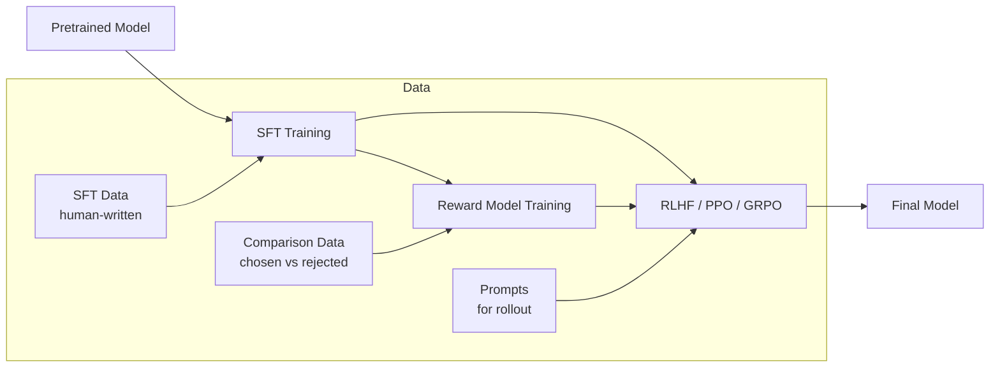
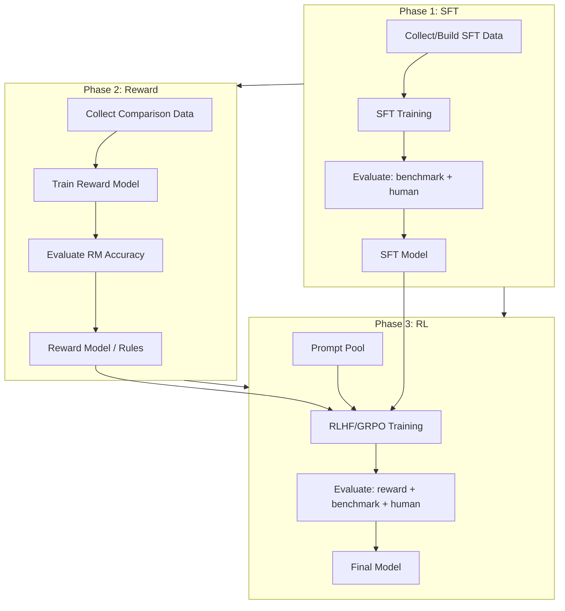

This post covers the core differences between SFT and RL, breaks down SFT loss computation, data construction, and training flow, then moves to RLHF (PPO/GRPO) integration. The goal is a complete zero-to-production path.

## 1. SFT vs RL: Core Differences

| Dimension | SFT (Supervised Fine-Tuning) | RL (Reinforcement Learning) |
|-----------|-----------------------------|-----------------------------|
| Learning signal | Human-annotated (input, output) pairs | Reward signal (scalar score) |
| Objective | Minimize cross-entropy loss | Maximize expected reward |
| Data requirements | High-quality annotated data | Prompts + reward function/model |
| Exploration | None (only imitates annotations) | Yes (generates diverse rollouts) |
| Training stability | High (standard supervised learning) | Low (reward hacking, mode collapse) |
| Compute cost | Low (single model forward/backward) | High (multi-model coordination + rollout generation) |
| Best for | Instruction following, format alignment | Reasoning, creativity, preference alignment |

> **SFT teaches a model "how to say it"; RL teaches it "what's good to say."** SFT makes the model learn specific input-output mappings; RL makes it learn to maximize an objective under constraints. They're complementary: SFT first for basic format, then RL for optimal strategy.

## 2. SFT Loss in Detail

### 2.1 Standard Cross-Entropy Loss

Given input sequence $x = (x_1, \dots, x_m)$ and target output $y = (y_1, \dots, y_n)$, the SFT loss is negative log-likelihood over target tokens:

$$
\mathcal{L}_{SFT} = -\frac{1}{n} \sum_{t=1}^{n} \log P_\theta(y_t | x, y_{<t})
$$

Key points:
- **Loss only on output tokens**: input prompt tokens don't contribute to loss (via label masking)
- **Teacher forcing**: during training, $y_{<t}$ uses ground truth, not the model's own predictions
- **Autoregressive**: $P_\theta(y_t | x, y_{<t})$ is the causal language model's conditional probability

### 2.2 Label Masking

```python
def compute_sft_loss(logits, labels, ignore_index=-100):
    """
    logits: (B, T, V) — model output logits
    labels: (B, T) — target token IDs, prompt portion set to ignore_index
    """
    # Shift: predict next token
    shift_logits = logits[:, :-1, :].contiguous()  # (B, T-1, V)
    shift_labels = labels[:, 1:].contiguous()       # (B, T-1)

    # Cross-entropy loss, ignoring prompt portion
    loss = F.cross_entropy(
        shift_logits.view(-1, shift_logits.size(-1)),
        shift_labels.view(-1),
        ignore_index=ignore_index,
        reduction='mean'
    )
    return loss
```

Label construction in data:

```python
def create_labels(input_ids, prompt_length):
    """
    input_ids: [prompt_tokens..., response_tokens..., eos]
    labels: [-100, -100, ..., response_tokens..., eos]
    """
    labels = input_ids.clone()
    labels[:prompt_length] = -100  # Don't compute loss on prompt
    return labels
```

### 2.3 Loss Variants

| Variant | Formula | Use Case |
|---------|---------|----------|
| Standard CE | $-\frac{1}{n}\sum \log P(y_t)$ | General SFT |
| Weighted CE | $-\frac{1}{n}\sum w_t \log P(y_t)$ | Emphasize certain tokens (e.g., key steps) |
| Length-normalized | $-\frac{1}{n}\sum \log P(y_t)$ | Avoid penalizing long responses |
| Sequence-level | $-\log P(y_{1:n})$ | Overall sequence probability |

## 3. SFT Training in Practice

### 3.1 Data Construction

Good SFT data is the foundation of training quality. The typical format is conversation-style:

```json
{
  "conversations": [
    {"role": "system", "content": "You are a helpful assistant."},
    {"role": "user", "content": "Write a Python function to sort a list."},
    {"role": "assistant", "content": "```python\ndef sort_list(lst):\n    return sorted(lst)\n```"}
  ]
}
```

**Data quality checklist:**

- Diversity: cover various patterns of the target task
- Consistency: similar questions should have consistently styled answers
- Correctness: especially for code and math, answers must be correct
- Length distribution: avoid only short or only long responses
- Deduplication: repeated data leads to overfitting

### 3.2 Training Code Framework

```python
from transformers import AutoModelForCausalLM, AutoTokenizer
from torch.utils.data import DataLoader
import torch

# Load model
model = AutoModelForCausalLM.from_pretrained(
    "Qwen/Qwen2.5-7B",
    torch_dtype=torch.bfloat16,
    attn_implementation="flash_attention_2"
)
tokenizer = AutoTokenizer.from_pretrained("Qwen/Qwen2.5-7B")

# Data preprocessing
def preprocess(example):
    text = tokenizer.apply_chat_template(
        example["conversations"],
        tokenize=False,
        add_generation_prompt=False
    )
    encoded = tokenizer(text, truncation=True, max_length=4096)

    # Compute prompt length, mask prompt labels
    prompt_text = tokenizer.apply_chat_template(
        example["conversations"][:-1],  # Exclude assistant response
        tokenize=False,
        add_generation_prompt=True
    )
    prompt_len = len(tokenizer(prompt_text)["input_ids"])

    labels = encoded["input_ids"].copy()
    labels[:prompt_len] = [-100] * prompt_len

    return {
        "input_ids": encoded["input_ids"],
        "attention_mask": encoded["attention_mask"],
        "labels": labels
    }

# Training loop
optimizer = torch.optim.AdamW(model.parameters(), lr=2e-5, weight_decay=0.01)

for epoch in range(3):
    for batch in dataloader:
        outputs = model(**batch)
        loss = outputs.loss

        loss.backward()
        torch.nn.utils.clip_grad_norm_(model.parameters(), 1.0)
        optimizer.step()
        optimizer.zero_grad()

        print(f"Loss: {loss.item():.4f}")
```

### 3.3 Common Hyperparameters

| Parameter | Recommended Value | Notes |
|-----------|------------------|-------|
| Learning rate | 1e-5 ~ 5e-5 | Too high causes forgetting, too low converges slowly |
| Batch size | 128-512 (global) | Use gradient accumulation |
| Epochs | 2-3 | More causes overfitting |
| Warmup | 3-5% steps | Linear warmup + cosine decay |
| Weight decay | 0.01-0.1 | Prevents overfitting |
| Max length | 2048-8192 | Depends on data distribution |
| Gradient clipping | 1.0 | Prevents gradient explosion |

### 3.4 Evaluation

Post-SFT evaluation shouldn't rely on loss alone (low loss doesn't guarantee good generation quality). Use comprehensive evaluation:

- **Loss / Perplexity**: baseline metric, check convergence
- **Generation quality**: benchmarks (HumanEval, MBPP for code; GSM8K for math)
- **Format compliance**: check if outputs follow instruction format
- **Human evaluation**: gold standard, but expensive

## 4. RLHF Integration

### 4.1 SFT to RLHF Pipeline



### 4.2 PPO Loss

PPO's objective is to maximize reward without drifting too far from the reference model:

$$
\mathcal{L}_{PPO} = -\mathbb{E}\left[\min\left(\frac{\pi_\theta(a|s)}{\pi_{old}(a|s)} A^{\pi_{old}}, \text{clip}\left(\frac{\pi_\theta(a|s)}{\pi_{old}(a|s)}, 1-\epsilon, 1+\epsilon\right) A^{\pi_{old}}\right)\right]
$$

With KL constraint:

$$
\mathcal{L}_{total} = \mathcal{L}_{PPO} + \beta \cdot D_{KL}(\pi_\theta \| \pi_{ref})
$$

Where:
- $\pi_\theta$: current policy (actor)
- $\pi_{old}$: previous step's policy
- $\pi_{ref}$: reference model (post-SFT model)
- $A^{\pi_{old}}$: advantage (estimated via GAE)
- $\epsilon$: clipping range (typically 0.1-0.2)
- $\beta$: KL penalty coefficient (typically 0.01-0.1)

### 4.3 GRPO Loss

GRPO (Group Relative Policy Optimization) simplifies PPO by removing the need for a critic model:

$$
\mathcal{L}_{GRPO} = -\mathbb{E}_{q \sim \mathcal{D}} \left[\mathbb{E}_{o_i \sim \pi_\theta(q)} \left[\frac{1}{G}\sum_{i=1}^{G} \min\left(\frac{\pi_\theta(o_i|q)}{\pi_{old}(o_i|q)} \hat{A}_i, \text{clip}(\cdot) \hat{A}_i\right)\right]\right]
$$

Where advantage is estimated directly from multiple rollouts of the same prompt:

$$
\hat{A}_i = \frac{r_i - \text{mean}(r_1, \dots, r_G)}{\text{std}(r_1, \dots, r_G)}
$$

> **GRPO's advantage:** No need to train a critic model (saves memory and compute); advantage is estimated directly from the reward distribution within the group. For code and math tasks (clear reward signals: code passes tests / math answer is correct), GRPO typically matches or exceeds PPO performance.

### 4.4 Reward Design

| Reward Type | Implementation | Use Case |
|-------------|---------------|----------|
| Learned RM | Train a reward model | General preference alignment |
| Rule-based | Code execution pass/fail | Code generation |
| Math verify | Check if final answer is correct | Math reasoning |
| Format check | Verify output format compliance | Instruction following |
| Composite | Weighted combination of multiple rewards | Complex tasks |

```python
def compute_reward(prompt, response):
    """Composite reward example"""
    reward = 0.0

    # Rule 1: Is the code executable
    if is_code_task(prompt):
        passed, total = run_test_cases(response)
        reward += 1.0 * (passed / total)

    # Rule 2: Format compliance
    if follows_format(response):
        reward += 0.2

    # Rule 3: Length penalty (avoid verbosity)
    length_penalty = max(0, len(response) - 2000) * 0.0001
    reward -= length_penalty

    return reward
```

## 5. Common Pitfalls

### 5.1 SFT Phase

- **Label masking errors**: The most common bug. If prompt labels aren't correctly masked (set to -100), the model tries to "memorize" the prompt, causing abnormally low loss but poor generation quality.
- **Tokenizer padding side**: Causal LMs typically need left padding (not right), otherwise positional encodings for the last few tokens break.
- **Chat template mismatch**: Training and inference chat templates must be identical. Use `tokenizer.apply_chat_template()` instead of manual string concatenation.

### 5.2 RL Phase

- **Reward hacking**: The model learns to "game" the reward. For example, in math tasks: outputting only the answer without reasoning steps; in code tasks: outputting empty programs that pass empty test suites. Solution: add format rewards, add process rewards.
- **KL coefficient too high/low**: $\beta$ too high means the model won't explore, degenerating to the SFT model; $\beta$ too low means the model drifts too far, generating uncontrollable outputs. Start at 0.05 and adjust dynamically.
- **Poor rollout quality**: If the SFT model is weak, RL-phase rollouts are low quality, reward signals are noisy, and training is unstable. RL's ceiling depends on SFT's floor.

### 5.3 Engineering Level

- **Memory management**: PPO needs actor, critic, and reference models all on GPU simultaneously. One 7B model in FP16 is 14 GB; three is 42 GB; add optimizer states and KV Cache and you easily exceed 80 GB. Solutions: LoRA to reduce trainable parameters, CPU offloading, smaller critic.
- **Rollout speed**: The bottleneck in RL training is usually rollout generation (requires inference). Use SGLang/vLLM for efficient inference with continuous batching.
- **Checkpoint frequency**: RL training is unstable; reward can drop suddenly. Save checkpoints every 50-100 steps for easy rollback.

## 6. Complete Pipeline



## Summary

Key takeaways worth remembering:

- SFT is a prerequisite for RL: without a good SFT model, RL has nothing to work with
- SFT's key is data quality and label masking; the technique itself isn't hard
- RL's key is reward design and training stability; algorithm choice (PPO vs GRPO) is secondary
- For code and math tasks, rule-based reward + GRPO is currently the best value proposition
- Engineering-wise, memory management and rollout speed are the two main bottlenecks
- Start simple: first get SFT working, then add rule-based reward with GRPO, then consider learned RM + PPO
