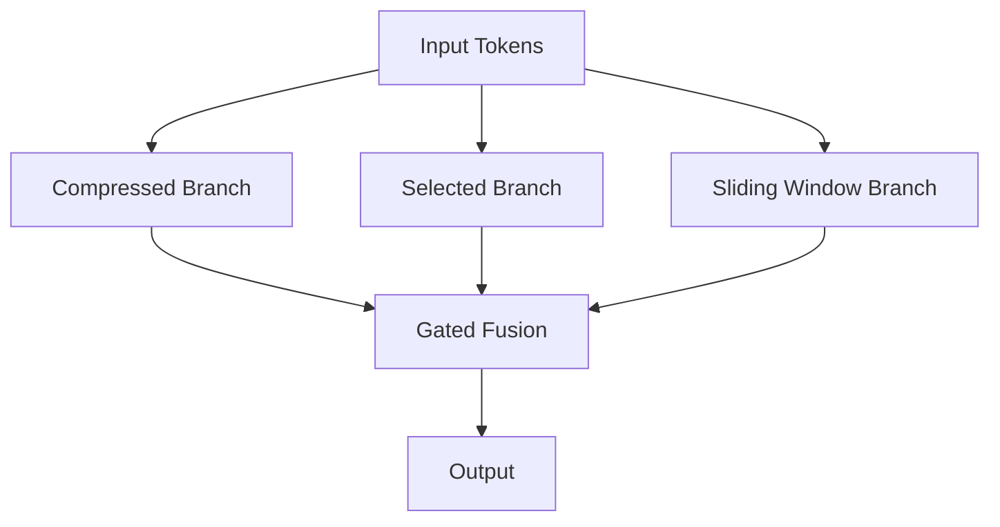

这篇文章从最基础的 Full Attention 出发， 拆解 Sparse 和 Linear 两条逃逸路线， 一路讲到 DeepSeek 的 NSA（Native Sparse Attention）和 Gated Linear Attention（GLA）。 每个机制都会给出数学公式、计算复杂度、工程取舍， 以及它们在实际部署中的表现。

## 1. Standard Full Attention

标准的 Scaled Dot-Product Attention 是一切的起点：

$$
\text{Attention}(Q, K, V) = \text{softmax}\left(\frac{QK^T}{\sqrt{d_k}}\right) V
$$

其中：
- $Q \in \mathbb{R}^{N \times d_k}$， $K \in \mathbb{R}^{N \times d_k}$， $V \in \mathbb{R}^{N \times d_v}$
- $N$ 是序列长度， $d_k$ 是 key 的维度

**复杂度分析： **

| 维度 | 复杂度 |
|------|--------|
| 时间复杂度 | $O(N^2 d)$ |
| 空间复杂度（注意力矩阵） | $O(N^2)$ |
| KV Cache（推理） | $O(N \cdot d)$ per layer |

> **核心问题： ** $O(N^2)$ 意味着序列长度翻倍， 计算量翻四倍。 当 $N$ 到达 128K 甚至 1M 时， 这个二次方的代价变得不可承受。

Multi-Head Attention 把 $d_{model}$ 拆成 $h$ 个头， 每个头独立做 attention 再拼接：

$$
\text{MultiHead}(Q, K, V) = \text{Concat}(\text{head}_1, \dots, \text{head}_h) W^O
$$

$$
\text{head}_i = \text{Attention}(Q W_i^Q, K W_i^K, V W_i^V)
$$

其中 $W_i^Q \in \mathbb{R}^{d_{model} \times d_k}$， $W_i^K \in \mathbb{R}^{d_{model} \times d_k}$， $W_i^V \in \mathbb{R}^{d_{model} \times d_v}$， $W^O \in \mathbb{R}^{h d_v \times d_{model}}$。

## 2. 两条逃逸路线： Sparse vs Linear

面对 $O(N^2)$， 社区走出了两条完全不同的路：

| 维度 | Sparse Attention | Linear Attention |
|------|-----------------|-----------------|
| 核心思路 | 只算部分 token pair | 用核函数绕开 softmax |
| 注意力矩阵 | 稀疏的 $N \times N$ | 不显式构造 |
| 时间复杂度 | $O(N \sqrt{N})$ 到 $O(N \log N)$ | $O(N d^2)$ |
| 信息丢失 | 只看部分 token | 没有显式遗忘 |
| 代表工作 | Longformer, BigBird, NSA | Linear Transformer, GLA, RetNet |
| 硬件友好度 | 中等（稀疏访存不规则） | 高（矩阵乘法为主） |
| 长上下文表现 | 取决于稀疏模式设计 | 理论好， 实践需要遗忘门 |

> **选 Sparse 还是 Linear？** 不是非此即彼。 DeepSeek 的 NSA 证明了混合路线（Sparse + 压缩 + 滑动窗口）才是工程最优解。 GLA 则证明 Linear Attention 加上遗忘门可以在特定场景下替代 Full Attention。

## 3. Sparse Attention

### 3.1 基本稀疏模式

Sparse Attention 的核心思想： 不是每个 token 都需要看到所有其他 token。 只保留"重要"的 token pair， 把注意力矩阵从稠密变稀疏。

**滑动窗口（Sliding Window）**

每个 token 只看前后 $w$ 个 token：

$$
A_{ij} = \begin{cases} \text{softmax}(q_i k_j^T / \sqrt{d_k}) & \text{if } |i - j| \leq w \\ 0 & \text{otherwise} \end{cases}
$$

- 复杂度： $O(Nw)$， 线性于 $N$
- 问题： 纯局部， 无法捕获长距离依赖

**全局 Token（Global Tokens）**

选择少量 token（如 [CLS]、段首 token）可以 attend 到所有位置， 也可以被所有位置 attend：

$$
\text{GlobalSet} = \{t_1, t_2, \dots, t_g\}, \quad g \ll N
$$

- 全局 token 数量 $g$ 通常是 $O(\sqrt{N})$ 或固定常数
- 为整个序列提供信息汇聚点

**随机连接（Random Connections）**

随机选取一部分 token pair 保留连接， 理论依据是随机图的小世界性质 —— 任意两个节点之间只需要很少的跳数就能连通。

### 3.2 Longformer & BigBird

**Longformer** 把三种模式组合起来：

1. 滑动窗口（局部）—— 每层都有
2. 扩张滑动窗口（Dilated）—— 间隔采样， 扩大感受野
3. 全局注意力 —— 任务相关的 token 标记为全局

复杂度从 $O(N^2)$ 降到 $O(Nw)$， 其中 $w$ 是窗口大小。

**BigBird** 在 Longformer 的基础上加了随机注意力：

$$
\text{BigBird} = \text{Sliding Window} + \text{Global Tokens} + \text{Random Connections}
$$

理论证明： BigBird 的稀疏注意力模式是图灵完备的， 且是序列到序列函数的通用近似器。

### 3.3 稀疏注意力的工程挑战

稀疏模式在理论上很美， 但工程上有几个硬问题：

> **硬件不友好： ** GPU 的 Tensor Core 针对稠密矩阵乘法优化。 稀疏的注意力模式意味着不规则的内存访问， 很难利用硬件的全部带宽。 FlashAttention 的 block-sparse 变体是目前最好的折中方案， 但仍然需要稀疏模式在 block 级别对齐。

- 稀疏模式需要在编译期/初始化期确定， 动态稀疏更难优化
- 不同层可能需要不同的稀疏模式
- 推理时 KV Cache 仍然是 $O(N)$， 稀疏只帮了计算不帮存储

## 4. Linear Attention

### 4.1 核函数技巧

标准 Attention 的瓶颈在 softmax —— 它强制要求先算 $QK^T$（$N \times N$ 矩阵）， 才能做归一化。 Linear Attention 用核函数绕开了这一步。

设 $\phi: \mathbb{R}^d \to \mathbb{R}^D$ 是一个特征映射函数， 满足：

$$
\text{sim}(q, k) = \phi(q)^T \phi(k) \approx \exp(q^T k / \sqrt{d_k})
$$

那么 attention 可以改写为：

$$
o_i = \frac{\sum_{j=1}^{N} \phi(q_i)^T \phi(k_j) \cdot v_j}{\sum_{j=1}^{N} \phi(q_i)^T \phi(k_j)}
$$

### 4.2 计算顺序的魔法

关键在于矩阵乘法的结合律。 上面的公式按 $(QK^T)V$ 计算是 $O(N^2 d)$。 但如果先算 $K^T V$：

$$
o_i = \frac{\phi(q_i)^T \left(\sum_{j=1}^{N} \phi(k_j) v_j^T\right)}{\phi(q_i)^T \left(\sum_{j=1}^{N} \phi(k_j)\right)}
$$

设 $S = \sum_{j=1}^{N} \phi(k_j) v_j^T \in \mathbb{R}^{D \times d_v}$， $z = \sum_{j=1}^{N} \phi(k_j) \in \mathbb{R}^{D}$， 则：

$$
o_i = \frac{\phi(q_i)^T S}{\phi(q_i)^T z}
$$

- $S$ 和 $z$ 的计算： $O(N D d_v)$
- 每个 $o_i$ 的计算： $O(D d_v)$
- 总复杂度： $O(N D d_v) = O(N d^2)$（当 $D = O(d)$ 时）

> **从 $O(N^2 d)$ 到 $O(N d^2)$： ** 当 $N \gg d$ 时（长序列）， 这是质的飞跃。 128K 序列、$d=128$ 的场景下， $N^2 / d \approx 128K$ 倍的加速。

### 4.3 RNN 等价形式

Linear Attention 有一个优雅的 RNN 等价：

$$
S_t = S_{t-1} + \phi(k_t) v_t^T
$$

$$
z_t = z_{t-1} + \phi(k_t)
$$

$$
o_t = \frac{\phi(q_t)^T S_t}{\phi(q_t)^T z_t}
$$

- $S_t \in \mathbb{R}^{D \times d_v}$ 是"状态矩阵"， 相当于压缩版的 KV Cache
- 推理时只需要维护 $S_t$ 和 $z_t$， 空间复杂度 $O(Dd_v)$， 与序列长度无关
- 这意味着 Linear Attention 模型可以像 RNN 一样做恒定内存推理

### 4.4 致命缺陷： 永不遗忘

RNN 形式揭示了一个致命问题： $S_t = S_{t-1} + \phi(k_t) v_t^T$。

信息只有加法， 没有遗忘。 随着序列变长：
- $S_t$ 会被越来越多的历史信息"淹没"
- 新 token 的信号被稀释
- 实际表现： 序列超过一定长度后， 质量急剧下降

> **这就是为什么纯 Linear Attention 在实践中表现不如 Full Attention。 ** 后续的改进（RetNet、GLA、Mamba）本质上都是在解决这个遗忘问题。

## 5. DeepSeek NSA（Native Sparse Attention）

DeepSeek 的 NSA 是目前 Sparse Attention 工程化做得最好的方案之一。 它不是学术上的新 idea， 而是把已有的稀疏模式用硬件感知的方式组合起来。

### 5.1 三分支架构

NSA 的核心设计是三个并行分支：



**Branch 1: Compressed Attention（压缩分支）**

把连续的 token 分块， 每个块压缩成一个代表 token：

$$
\tilde{k}_m = \text{MLP}_k\left(\text{concat}(k_{(m-1)l+1}, \dots, k_{ml})\right)
$$

$$
\tilde{v}_m = \text{MLP}_v\left(\text{concat}(v_{(m-1)l+1}, \dots, v_{ml})\right)
$$

其中 $l$ 是块大小（如 32）， $m$ 是块索引。 序列长度从 $N$ 降到 $N/l$。

- 作用： 捕获全局粗粒度信息
- 复杂度： $O(N \cdot N/l \cdot d) = O(N^2 d / l)$

**Branch 2: Selected Attention（选择分支）**

用 Compressed Attention 的分数选出 Top-$p$ 个重要的 token 块， 只对这些块做完整的 attention：

$$
\text{TopBlocks} = \text{argtop}_p\left(\sum_{i \in \text{block}_m} A_{compressed}(q, \tilde{k}_m)\right)
$$

- 作用： 精细关注关键位置
- 复杂度： $O(N \cdot p \cdot l \cdot d)$， 其中 $p \ll N/l$

**Branch 3: Sliding Window Attention（滑动窗口分支）**

标准滑动窗口， 窗口大小 $w$：

- 作用： 捕获局部上下文
- 复杂度： $O(Nw d)$

### 5.2 门控融合

三个分支的输出通过 sigmoid 门控混合：

$$
o = g_1 \cdot o_{compressed} + g_2 \cdot o_{selected} + g_3 \cdot o_{sliding}
$$

$$
g_1, g_2, g_3 = \sigma(W_g \cdot q + b_g)
$$

门控是 query-dependent 的： 不同的 query 可以学习不同的分支偏好。

### 5.3 硬件对齐设计

NSA 的一个关键设计决策是 **所有操作都在连续的 block 上进行**：

- 压缩分支： block-wise MLP
- 选择分支： 选的是连续 block， 不是散落的 token
- 滑动窗口： 天然连续

> **为什么这很重要？** GPU 的 HBM 到 SRAM 的数据传输效率取决于连续性。 FlashAttention 已经证明了 block-wise 计算可以避免 $O(N^2)$ 的显存占用。 NSA 的所有分支都天然适配 block-wise kernel， 不需要为稀疏模式做特殊的内存布局。

### 5.4 性能数据

DeepSeek 在论文中报告的数据（27B 模型， 64K 上下文）：

| 指标 | Full Attention | NSA |
|------|---------------|-----|
| 训练速度 | 1x | ~1.6x |
| 推理延迟（64K 上下文）| 1x | ~3x 更快 |
| Needle-in-a-Haystack | 97.5% | 97.2% |
| 长文本困惑度 | baseline | 接近 baseline |

关键观察：
- 质量几乎无损
- 训练阶段也有加速（因为三分支总计算量 < full $N^2$）
- 推理阶段加速更大（KV Cache 可以只存压缩后的 + 滑动窗口的）

## 6. GLA（Gated Linear Attention）

GLA 的核心贡献： 给 Linear Attention 加上了遗忘门， 解决"永不遗忘"的致命缺陷。

### 6.1 遗忘门

回顾 Linear Attention 的 RNN 形式： $S_t = S_{t-1} + \phi(k_t) v_t^T$。 GLA 加入一个 forget gate $\alpha_t \in (0, 1)^{d \times d}$（简化为对角矩阵 $\text{diag}(\alpha_t)$）：

$$
S_t = \text{diag}(\alpha_t) \cdot S_{t-1} + k_t v_t^T
$$

$$
o_t = q_t^T S_t
$$

当 $\alpha_t = 1$ 时退化为标准 Linear Attention；当 $\alpha_t < 1$ 时， 历史信息指数衰减。

$\alpha_t$ 是数据依赖的：

$$
\alpha_t = \sigma(W_\alpha x_t + b_\alpha)
$$

模型可以学习对不同类型的 token 使用不同的遗忘速率。

### 6.2 Chunk-wise 并行训练

GLA 的 RNN 形式适合推理但不适合训练（串行）。 论文提出了 chunk-wise parallel 算法：

1. 把序列切成大小为 $C$ 的 chunk
2. chunk 内用并行的矩阵乘法（类似 Full Attention）
3. chunk 间用 RNN 递推（传递 $S$ 状态）

```python
# 伪代码：GLA chunk-wise 训练
def gla_chunk_forward(Q, K, V, alpha, chunk_size=64):
    N = Q.shape[1]
    S = torch.zeros(batch, d, d_v)  # 状态矩阵
    outputs = []

    for i in range(0, N, chunk_size):
        q = Q[:, i:i+chunk_size]  # (B, C, d)
        k = K[:, i:i+chunk_size]  # (B, C, d)
        v = V[:, i:i+chunk_size]  # (B, C, d_v)
        a = alpha[:, i:i+chunk_size]  # (B, C, d)

        # chunk 内部：并行计算 attention
        # 构造 chunk 内的衰减矩阵
        decay = compute_intra_chunk_decay(a)  # (B, C, C)
        intra = (q @ k.transpose(-1, -2)) * decay  # (B, C, C)
        o_intra = intra @ v  # (B, C, d_v)

        # 跨 chunk：从 S 中读取历史信息
        chunk_decay = compute_chunk_decay(a)  # (B, d)
        o_inter = q @ (chunk_decay.unsqueeze(-1) * S)  # (B, C, d_v)

        # 合并
        o = o_intra + o_inter
        outputs.append(o)

        # 更新状态 S
        S = update_state(S, k, v, a)

    return torch.cat(outputs, dim=1)
```

训练复杂度： $O(NC^2 + N d^2)$， 其中 $C$ 是 chunk 大小， 通常取 64-256。 当 $C \ll N$ 时接近线性。

### 6.3 GLA 家族

| 模型 | 遗忘门 | 状态维度 | 训练并行 | 年份 |
|------|--------|---------|---------|------|
| Linear Transformer | 无 | $d \times d_v$ | 全并行 | 2020 |
| RetNet | 固定衰减 $\gamma^{t-s}$ | $d \times d_v$ | chunk-wise | 2023 |
| GLA | 数据依赖 $\alpha_t$ | $d \times d_v$ | chunk-wise | 2024 |
| Mamba (S6) | 数据依赖 | $d \times N_{state}$ | scan | 2024 |
| Mamba2 | 数据依赖 | $d \times d_v$ | chunk-wise | 2024 |

> **趋势： ** 从固定衰减到数据依赖遗忘门， 从纯 RNN 训练到 chunk-wise 并行， Linear Attention 家族在逐步逼近"训练时像 Transformer， 推理时像 RNN"的理想状态。

### 6.4 在 Qwen3-Coder-Next 中的部署

Qwen3-Coder-Next 采用了 hybrid 架构：

- 部分层使用 Full Attention（保证全局信息流通）
- 部分层使用 GLA（降低推理 KV Cache 压力）
- 交替排列， 典型配比如 1:3（每 4 层中 1 层 Full + 3 层 GLA）

工程影响：
- KV Cache 大幅减少（GLA 层只需要维护 $d \times d_v$ 的状态矩阵， 而不是完整的 KV 缓存）
- 推理速度更快（GLA 层的计算是 $O(d^2)$ per token， 不随上下文长度增长）
- 训练速度接近纯 Transformer（chunk-wise parallel 训练保证了 GPU 利用率）

## 7. 全景对比

| 机制 | 时间复杂度 | 空间复杂度 | 长上下文质量 | 推理 KV Cache | 硬件友好度 | 训练难度 |
|------|-----------|-----------|-------------|--------------|-----------|---------|
| Full Attention | $O(N^2 d)$ | $O(N^2)$ | 最好 | $O(Nd)$ per layer | 高 (FlashAttn) | 简单 |
| Longformer | $O(Nw)$ | $O(Nw)$ | 好 | $O(Nd)$ | 中 | 简单 |
| BigBird | $O(N(w+g+r))$ | $O(N(w+g+r))$ | 好 | $O(Nd)$ | 中 | 简单 |
| NSA | $O(N \cdot (N/l + pl + w))$ | $O(N)$ | 接近 Full | $O(N/l \cdot d + wd)$ | 高 (block-wise) | 中等 |
| Linear Attention | $O(Nd^2)$ | $O(d^2)$ | 差 (无遗忘) | $O(d^2)$ | 高 | 简单 |
| GLA | $O(NC^2 + Nd^2)$ | $O(d^2)$ | 好 | $O(d^2)$ | 高 | 中等 |
| Mamba2 | $O(NC^2 + Nd^2)$ | $O(d^2)$ | 好 | $O(d^2)$ | 高 | 中等 |

## 8. 架构演化路线

```mermaid
graph LR
    FA[Full Attention<br/>O&#40;N²&#41;] --> S[Sparse Route]
    FA --> L[Linear Route]

    S --> SW[Sliding Window]
    S --> GT[Global Tokens]
    S --> RC[Random Connections]
    SW --> LF[Longformer]
    GT --> LF
    GT --> BB[BigBird]
    RC --> BB
    SW --> NSA[DeepSeek NSA]

    L --> LT[Linear Transformer]
    L --> RN[RetNet]
    LT --> GLA_node[GLA]
    RN --> GLA_node
    L --> Ma[Mamba / S6]
    Ma --> Ma2[Mamba2]
    GLA_node --> Hy[Hybrid Models<br/>Qwen3-Coder-Next]
    NSA --> Hy
```



## 9. 工程落地要点

**对 kernel 工程师来说， 最重要的几个结论： **

1. **FlashAttention 是 Full Attention 的终极优化， 但它不改变 $O(N^2)$ 的本质。 ** 它把显存从 $O(N^2)$ 降到 $O(N)$， 但计算量不变。 长上下文场景仍然需要 Sparse 或 Linear。

2. **NSA 的三分支设计天然适配 block-wise kernel。 ** 压缩分支是 block reduce + MLP， 选择分支是 block gather + FlashAttention， 滑动窗口是标准 FlashAttention 的窗口变体。 三者都可以用现有的高效 kernel 实现。

3. **GLA 的 chunk-wise 训练本质上是"小 FlashAttention + RNN 递推"。 ** chunk 内的 attention 矩阵大小是 $C \times C$（如 $64 \times 64$）， 完全可以放进 SRAM。 chunk 间的状态传递是矩阵乘法， 适合 Tensor Core。

4. **Hybrid 架构（Full + GLA/Mamba）是当前工程最优解。 ** 用少量 Full Attention 层保证信息完整性， 大量 Linear 层降低推理成本。 这种架构的 kernel 开发需要同时支持两种 attention 模式。

5. **AMD MI300X/MI355X 上的部署考虑： **
   - FlashAttention： CK 已有高度优化的实现
   - NSA： 需要自定义 kernel（block-wise 压缩 + 选择）
   - GLA： Triton for ROCm 可以写 chunk-wise 训练 kernel， 但推理 kernel 需要手写 CK 来达到最优性能
   - Hybrid dispatch： 推理引擎需要根据层类型动态选择 kernel path

## 参考文献

- Vaswani et al., "Attention Is All You Need", NeurIPS 2017
- Beltagy et al., "Longformer: The Long-Document Transformer", 2020
- Zaheer et al., "Big Bird: Transformers for Longer Sequences", NeurIPS 2020
- Katharopoulos et al., "Transformers are RNNs: Fast Autoregressive Transformers with Linear Attention", ICML 2020
- Sun et al., "Retentive Network: A Successor to Transformer for Large Language Models", 2023
- Yang et al., "Gated Linear Attention Transformers with Hardware-Efficient Training", ICML 2024
- Gu & Dao, "Mamba: Linear-Time Sequence Modeling with Selective State Spaces", 2024
- Dao & Gu, "Transformers are SSMs: Generalized Models and Efficient Algorithms Through Structured State Space Duality", ICML 2024
- DeepSeek, "Native Sparse Attention: Hardware-Aligned and Natively Trainable Sparse Attention", 2025
