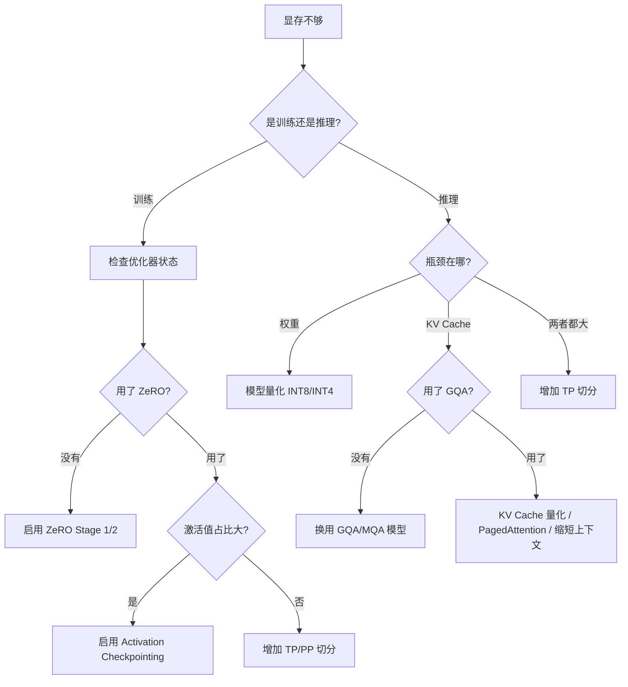

搞清楚一个 LLM 需要多少显存， 是做任何训练或推理方案之前必须回答的问题。 这篇文章把显存拆成几块， 给出每一块的计算公式， 再看分布式策略（DP、TP、PP、EP）怎么分摊它们。

## 1. 显存的六大组成

训练和推理阶段， GPU 显存里装的东西不一样。 训练阶段六大块都有， 推理阶段主要是模型权重和 KV Cache。

| 组件 | 符号 | 训练 | 推理 |
|------|------|------|------|
| 模型参数 | $M_{params}$ | 必须 | 必须 |
| 优化器状态 | $M_{optim}$ | 必须 | 无 |
| 梯度 | $M_{grad}$ | 必须 | 无 |
| 激活值 | $M_{act}$ | 必须（可 checkpoint） | 极小 |
| KV Cache | $M_{kv}$ | 无 | 必须 |
| 临时缓冲区 | $M_{buf}$ | 有 | 有 |

## 2. 基础变量

设模型参数量为 $P$（单位： 个）， 浮点格式占 $b$ 字节。

| 符号 | 含义 | 示例 |
|------|------|------|
| $P$ | 模型参数量 | 7B = $7 \times 10^9$ |
| $b$ | 每个参数占的字节数 | FP32=4, FP16/BF16=2, INT8=1, INT4=0.5 |
| $L$ | Transformer 层数 | 32 |
| $d$ | hidden dimension | 4096 |
| $d_{ff}$ | FFN 中间维度 | 11008 |
| $n_h$ | attention head 数 | 32 |
| $n_{kv}$ | KV head 数（GQA） | 8 |
| $V$ | 词表大小 | 32000 |
| $N$ | 序列长度 | 4096 |
| $B$ | batch size | 32 |

## 3. 各组件的显存公式

### 3.1 模型参数

$$
M_{params} = P \times b
$$

| 模型 | 参数量 | FP32 | FP16 | INT8 | INT4 |
|------|--------|------|------|------|------|
| 7B | 7B | 28 GB | 14 GB | 7 GB | 3.5 GB |
| 13B | 13B | 52 GB | 26 GB | 13 GB | 6.5 GB |
| 70B | 70B | 280 GB | 140 GB | 70 GB | 35 GB |

### 3.2 优化器状态（训练）

以 AdamW 为例， 每个参数需要存储：
- 一阶矩估计 $m$（FP32）
- 二阶矩估计 $v$（FP32）
- 主权重副本（如果混合精度， 需要 FP32 副本）

$$
M_{optim} = P \times (4 + 4 + 4) = 12P \quad \text{(mixed-precision AdamW)}
$$

如果用纯 FP32 训练：

$$
M_{optim} = P \times (4 + 4) = 8P \quad \text{(FP32 AdamW, 权重已算在 } M_{params} \text{)}
$$

> **混合精度训练的显存开销： ** 一个 7B 模型用 mixed-precision AdamW， 光优化器状态就要 $7B \times 12 = 84$ GB。 这就是为什么训练 7B 模型至少需要一张 80GB A100/H100。

### 3.3 梯度（训练）

每个参数的梯度， 精度与训练精度一致：

$$
M_{grad} = P \times b_{grad}
$$

FP16 训练时 $b_{grad} = 2$， FP32 训练时 $b_{grad} = 4$。

### 3.4 激活值（训练）

激活值是 forward pass 中需要保存供 backward 使用的中间结果。 粗略估算（不使用激活重计算）：

$$
M_{act} \approx 2 \times B \times N \times d \times L \times b_{act}
$$

这是一个近似值。 实际上每层 attention 的 $O(BN^2n_h)$ 注意力矩阵也会贡献显存， 完整公式：

$$
M_{act} \approx L \times B \times N \times (34d + 5n_h N) \times b_{act}
$$

其中 $34d$ 来自各层的中间激活（Q、K、V、FFN 中间层等）， $5n_h N$ 来自注意力矩阵（softmax 前后都要存）。

**激活重计算（Activation Checkpointing）** 可以显著降低 $M_{act}$：

| 策略 | 激活显存 | 额外计算 |
|------|---------|---------|
| 不使用 | $M_{act}$ | 0 |
| 按层 checkpoint | $M_{act} / L$ | ~33% |
| 完全重计算 | $O(B \times N \times d)$ | ~100% |

### 3.5 KV Cache（推理）

$$
M_{kv} = 2 \times B \times N \times n_{kv} \times d_h \times L \times b_{kv}
$$

其中 $d_h = d / n_h$。

使用 GQA（Grouped-Query Attention）时， $n_{kv} < n_h$， KV Cache 相应缩小。

### 3.6 临时缓冲区

NCCL 通信缓冲区、CUDA workspace 等， 通常约 1-2 GB， 在总量中占比不大， 但需要预留。

## 4. 训练总显存估算

$$
M_{train} = M_{params} + M_{optim} + M_{grad} + M_{act} + M_{buf}
$$

对于 mixed-precision AdamW 训练 7B 模型（B=32, N=4096）：

| 组件 | 大小 |
|------|------|
| Model params (FP16) | 14 GB |
| Optimizer states (FP32 m + v + master) | 84 GB |
| Gradients (FP16) | 14 GB |
| Activations (估算) | ~60 GB |
| Buffers | ~2 GB |
| **总计** | **~174 GB** |

> **一张 80GB 的 A100/H100 装不下。 ** 这就是为什么训练 7B 模型需要分布式策略。

## 5. 推理总显存估算

$$
M_{infer} = M_{params} + M_{kv} + M_{buf}
$$

推理时的显存主要取决于模型精度和序列长度/batch size。

## 6. 分布式策略的显存分摊

### 6.1 数据并行（DP）

| 组件 | 单卡 | DP ($N_{dp}$ 卡) |
|------|------|-------------------|
| Model params | $P \times b$ | $P \times b$ (每卡完整副本) |
| Optimizer states | $12P$ | $12P$ (每卡完整副本) |
| Gradients | $P \times b_g$ | $P \times b_g$ (每卡完整) |
| Activations | $M_{act}(B)$ | $M_{act}(B / N_{dp})$ (batch 切分) |

DP 不减少权重和优化器的显存， 只减少激活值（因为 batch 被切分了）。

**ZeRO 优化： ** DeepSpeed 的 ZeRO 在 DP 基础上把优化器状态、梯度、参数分片到各卡：

| ZeRO Stage | 分片内容 | 显存节省 |
|------------|---------|---------|
| Stage 1 | Optimizer states | ~4x |
| Stage 2 | + Gradients | ~8x |
| Stage 3 | + Parameters | ~$N_{dp}$x |

### 6.2 张量并行（TP）

| 组件 | 单卡 | TP ($N_{tp}$ 卡) |
|------|------|-------------------|
| Model params | $P \times b$ | $P \times b / N_{tp}$ |
| Optimizer states | $12P$ | $12P / N_{tp}$ |
| Gradients | $P \times b_g$ | $P \times b_g / N_{tp}$ |
| Activations | $M_{act}$ | $\approx M_{act} / N_{tp}$ |

TP 把每一层的参数矩阵沿 hidden dimension 切分， 每卡只存 $1/N_{tp}$ 的参数。 代价是每层需要 2 次 all-reduce 通信。

### 6.3 流水线并行（PP）

| 组件 | 单卡 | PP ($N_{pp}$ 卡) |
|------|------|-------------------|
| Model params | $P \times b$ | $P \times b / N_{pp}$ |
| Optimizer states | $12P$ | $12P / N_{pp}$ |
| Activations | $M_{act}(L)$ | $M_{act}(L / N_{pp})$ + bubble |

PP 按层切分模型， 每卡只放 $L / N_{pp}$ 层。 代价是流水线气泡（bubble）导致的 GPU 空闲时间。

### 6.4 专家并行（EP）

对于 MoE 模型， EP 把不同的 expert 放在不同的卡上：

$$
M_{expert\_per\_card} = \frac{E \times P_{expert}}{N_{ep}} \times b
$$

其中 $E$ 是总 expert 数， $P_{expert}$ 是每个 expert 的参数量。

共享参数（attention、embedding 等）仍然在每张卡上都有：

$$
M_{moe\_card} = P_{shared} \times b + \frac{E \times P_{expert}}{N_{ep}} \times b
$$

### 6.5 组合策略

实际部署通常组合多种策略。 例如 8 张 GPU：

$$
\text{Total GPUs} = N_{dp} \times N_{tp} \times N_{pp} \times N_{ep}
$$

每张卡的显存：

$$
M_{card} = \frac{M_{params}}{N_{tp} \times N_{pp}} + \frac{M_{optim}}{N_{tp} \times N_{pp} \times N_{dp}^{ZeRO}} + M_{act}(B_{local}, L_{local}) + M_{buf}
$$

## 7. 具体案例： Qwen-2.5-7B 在 H100 上

**模型参数： **
- 参数量： 7.6B
- 层数： 32， hidden dimension： 4096
- FFN intermediate： 11008
- Attention heads： 32， KV heads： 8（GQA）
- 词表： 152000

**场景： 4x H100 80GB， FP16 推理， max context 32K**

单卡推理显存：

| 组件 | 计算 | 大小 |
|------|------|------|
| Model weights (FP16) | 7.6B * 2 | 15.2 GB |
| KV Cache (B=16, N=32K) | 2 * 16 * 32768 * 8 * 128 * 32 * 2 | 32.8 GB |
| Buffers | — | ~2 GB |
| **Total** | | **~50 GB** |

一张 H100 80GB 能装下。 但如果 batch 更大或序列更长， 就需要分卡。

**4 卡优化方案： **

| 方案 | TP | 权重/卡 | KV Cache/卡 | 总/卡 | 可用 batch |
|------|-----|---------|------------|-------|-----------|
| TP=1, 独立 4 实例 | 1 | 15.2 GB | 按需 | ~50 GB | B=16 per card |
| TP=2, 2 实例 | 2 | 7.6 GB | 按需 | ~40 GB | B=32 per pair |
| TP=4, 1 实例 | 4 | 3.8 GB | 按需 | ~35 GB | B=64 |

> **TP 的取舍： ** TP=4 时每卡权重最小（3.8 GB）， 留更多空间给 KV Cache， 能跑更大 batch。 但 TP 通信开销（每层 2 次 all-reduce）在 4 卡时已经比较明显， 尤其是 decode 阶段（计算量小， 通信占比高）。 实际选择取决于目标是最大 throughput 还是最低 latency。

## 8. 显存优化路径

## 总结

几个值得记住的经验数字：

- **FP16 推理**： 模型每 1B 参数 ≈ 2 GB
- **Mixed-precision 训练**： 模型每 1B 参数 ≈ 18-20 GB（包含优化器状态和梯度）
- **KV Cache**： Llama-7B 在 4K 上下文、batch=1 时约 2 GB；128K 时约 64 GB
- **TP 通信**： TP=2 和 TP=4 之间， 通信量翻倍， 收益递减
- **ZeRO Stage 2** 是训练的默认选择， Stage 3 只在单卡完全放不下模型时使用

显存计算不是精确科学 —— 框架本身的 overhead、内存碎片、CUDA context 都会额外占用。 但掌握这些公式， 至少能在规划硬件和配置方案时给出 80% 准确度的估算。
