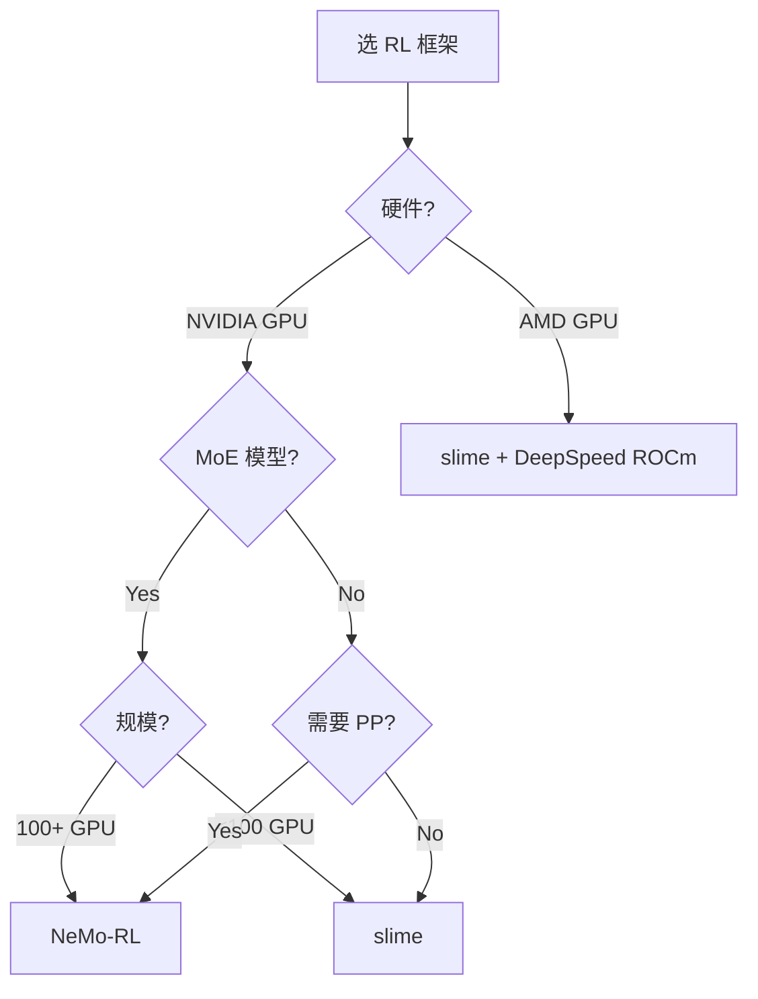

这篇文章对比两个面向 LLM 的 RL 训练框架： NVIDIA 的 NeMo-RL 和社区驱动的 slime。 从算法覆盖、工程质量、MoE 支持、ROCm 兼容性几个维度做深度对比， 最后给出选型建议。

## 1. 背景

### 1.1 为什么需要 RL 训练框架

SFT 训练直接用 HuggingFace Transformers 或 DeepSpeed 就能搞定。 但 RL（RLHF / GRPO / PPO）训练涉及多个角色的协调：

- **Actor**： 生成 rollout（需要推理能力）
- **Critic / Reward Model**： 打分（另一个模型或规则）
- **Reference Model**： 计算 KL 约束（防止偏移太远）
- **Trainer**： 根据 reward 和 KL 更新 actor 参数

这些角色的调度、通信、显存管理比 SFT 复杂得多， 需要专门的框架。

### 1.2 候选框架

| 框架 | 维护方 | 首次发布 | Stars | 核心定位 |
|------|--------|---------|-------|---------|
| NeMo-RL | NVIDIA | 2024-Q3 | ~2.5K | 生产级 RL 训练， 深度集成 NeMo / Megatron |
| slime | 社区 (字节 & 学界) | 2024-Q4 | ~1.8K | 轻量灵活的 RL 训练， 研究友好 |
| OpenRLHF | 社区 | 2023-Q2 | ~5K | 早期框架， PPO / DPO |
| TRL | HuggingFace | 2022-Q4 | ~10K | 入门级， 集成 Transformers 生态 |

本文聚焦 NeMo-RL 和 slime， 因为它们是目前工程质量和 MoE 支持最好的两个选择。

## 2. 功能矩阵

| 功能 | NeMo-RL | slime |
|------|---------|-------|
| PPO | 完整 (GAE, clipping) | 完整 |
| GRPO | 支持 | 支持 |
| DPO / SimPO | 支持 | 支持 |
| REINFORCE (w/ baseline) | 支持 | 支持 |
| 自定义 reward function | 有， 通过 config | 有， 通过 Python callable |
| 规则 reward (code exec, math verify) | 内置 sandbox | 内置 + 外部 API |
| Online RL (边生成边训练) | 支持 | 支持 |
| Offline RL (预生成 rollout) | 支持 | 支持 |
| Multi-turn RL | 有限 | 完整 (会话树) |

> **关键差异： ** NeMo-RL 的算法实现更成熟（经过 NVIDIA 内部大规模验证）， 但自定义灵活度稍低（配置驱动）。 slime 更 research-friendly（代码透明， 容易 fork 和改）， 但在超大规模（1000+ GPU）上的可靠性验证不如 NeMo-RL。

## 3. 架构对比

### 3.1 NeMo-RL

```
┌─────────────────────────────────────────┐
│              NeMo-RL Controller          │
│  (Hydra config → DAG of tasks)          │
├─────────────────────────────────────────┤
│                                         │
│  ┌─────────┐  ┌─────────┐  ┌────────┐  │
│  │ Actor   │  │ Critic  │  │ Ref    │  │
│  │(Megatron│  │(Megatron│  │(vLLM / │  │
│  │ + vLLM) │  │  Core)  │  │ static)│  │
│  └─────────┘  └─────────┘  └────────┘  │
│        ↕ NCCL / Gloo ↕                  │
│  ┌──────────────────────────────────┐   │
│  │     Megatron-Core Distributed    │   │
│  │     (TP/PP/DP/EP sharding)       │   │
│  └──────────────────────────────────┘   │
└─────────────────────────────────────────┘
```

特点：
- 基于 Megatron-Core 做分布式， 直接支持 TP / PP / EP
- Actor 的推理（rollout 生成）走 vLLM engine
- 训练更新走 Megatron 的 optimizer
- 配置驱动（Hydra YAML）， 改算法需要改 config 而非代码

### 3.2 slime

```
┌─────────────────────────────────────────┐
│           slime Orchestrator            │
│  (Python script → Ray actors)           │
├─────────────────────────────────────────┤
│                                         │
│  ┌──────────┐  ┌──────────┐             │
│  │ Rollout  │  │ Trainer  │             │
│  │ Workers  │  │ Workers  │             │
│  │ (SGLang /│  │(DeepSpeed│             │
│  │  vLLM)   │  │  ZeRO)   │             │
│  └──────────┘  └──────────┘             │
│        ↕ Ray Object Store ↕             │
│  ┌──────────────────────────────────┐   │
│  │       Ray Cluster + NCCL         │   │
│  └──────────────────────────────────┘   │
└─────────────────────────────────────────┘
```

特点：
- 基于 Ray 做调度， Rollout 和 Training 解耦为独立的 Ray actor group
- Rollout worker 可以用 SGLang 或 vLLM（可换引擎）
- Training worker 用 DeepSpeed ZeRO（简单但够用）
- 代码驱动（Python 脚本）， 改算法直接改代码

## 4. MoE 支持

这对我们的项目特别重要， 因为我们的目标模型（Kimi-K2.5、Qwen3-Coder-Next）都是 MoE。

| 维度 | NeMo-RL | slime |
|------|---------|-------|
| MoE 训练 | 原生支持 (Megatron-Core MoE) | 通过 DeepSpeed MoE |
| Expert Parallelism | 原生 EP | 依赖 DeepSpeed EP |
| MoE + TP + PP | 完整组合 | EP + TP 可用， PP 有限 |
| Expert load balancing loss | 内置 | 需手动加 |
| Token drop policy | 可配置 (capacity factor) | 需手动实现 |
| MoE rollout 推理 | vLLM MoE | SGLang MoE |

> **NeMo-RL 在 MoE 上更成熟。 ** Megatron-Core 的 MoE 实现经过大量验证， EP + TP + PP 三维并行可以直接用。 slime 的 DeepSpeed MoE 支持较新， 大规模场景（384 expert、TP=8、EP=8）的可靠性需要自己验证。

## 5. ROCm 兼容性

这是另一个关键维度。 我们的硬件是 MI300X / MI355X， 跑的是 ROCm 7.0。

| 维度 | NeMo-RL | slime |
|------|---------|-------|
| 官方 ROCm 支持 | 无（NVIDIA 框架） | 部分（社区 PR） |
| 依赖项 ROCm 兼容 | Megatron-Core: 有 fork | DeepSpeed: 官方支持 |
| NCCL vs RCCL | NCCL only | 可配 RCCL |
| Triton kernels | CUDA Triton | 可换 Triton-ROCm |
| FlashAttention | CUDA FA2 | 可换 CK FA |
| 实际可用性 | 需要大量 patch | 中等量 patch |

> **两个框架都不直接在 ROCm 上开箱即用。 ** 但 slime 更容易 port， 因为： (1) 依赖链更短（Ray + DeepSpeed vs Megatron-Core 全家桶）；(2) DeepSpeed 官方支持 ROCm；(3) 推理引擎可以选 SGLang（ROCm 支持好）。 NeMo-RL 对 Megatron-Core 的深度依赖使得 ROCm 适配工作量大得多。

## 6. DX 和可复现性

| 维度 | NeMo-RL | slime |
|------|---------|-------|
| 安装 | `pip install nemo-rl`（但 Megatron-Core 要单独装） | `pip install slime-rl` |
| 最小可运行示例 | ~50 行 YAML | ~30 行 Python |
| 文档 | 好（NVIDIA 风格， 完整但密） | 中等（README + examples） |
| Wandb / TensorBoard | 内置 | 内置 |
| Checkpoint 格式 | Megatron 格式（需要转换） | HuggingFace 格式（直接用） |
| 复现论文结果 | 有 benchmark suite | 有 recipe 脚本 |
| Debug 友好度 | 难（Megatron 层数多） | 好（代码简单） |

> **slime 的 DX 更好。 ** HuggingFace 格式的 checkpoint 意味着不需要做格式转换就能和推理引擎对接。 NeMo-RL 的 Megatron checkpoint 需要转成 HF 格式才能在 SGLang / vLLM 上推理， 这一步有时候很痛苦（尤其是 MoE 模型）。

## 7. 迁移方案

如果要从零开始选型：



对于我们的场景（AMD MI300X / MI355X， MoE 模型， 研究迭代为主）：

1. **短期（1-2 月）**： 用 slime + SGLang + DeepSpeed on ROCm
2. **中期（3-6 月）**： 贡献 slime 的 ROCm + CK 优化 patch， 建立 benchmark baseline
3. **长期**： 如果需要超大规模（1000+ GPU）， 评估 NeMo-RL ROCm fork 的可行性

## 8. 结论

| 维度 | 赢家 | 原因 |
|------|------|------|
| 算法成熟度 | NeMo-RL | NVIDIA 内部大规模验证 |
| MoE 支持 | NeMo-RL | Megatron-Core MoE 更完整 |
| ROCm 兼容性 | slime | 依赖链短， DeepSpeed 官方支持 ROCm |
| 开发体验 | slime | HF checkpoint、Python 驱动、debug 友好 |
| 可定制性 | slime | 代码透明， 容易 fork |
| 大规模可靠性 | NeMo-RL | 在 1000+ GPU 上验证过 |

没有绝对的赢家。 NeMo-RL 适合 NVIDIA 硬件上的生产级大规模训练， slime 适合研究迭代和 AMD 硬件。 对我们来说， slime 是当前的正确选择， 但需要在 MoE + ROCm 场景下做充分验证。
