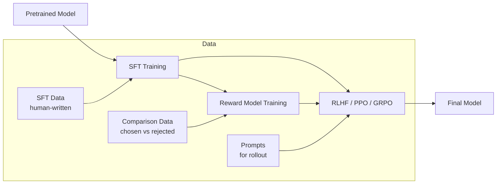
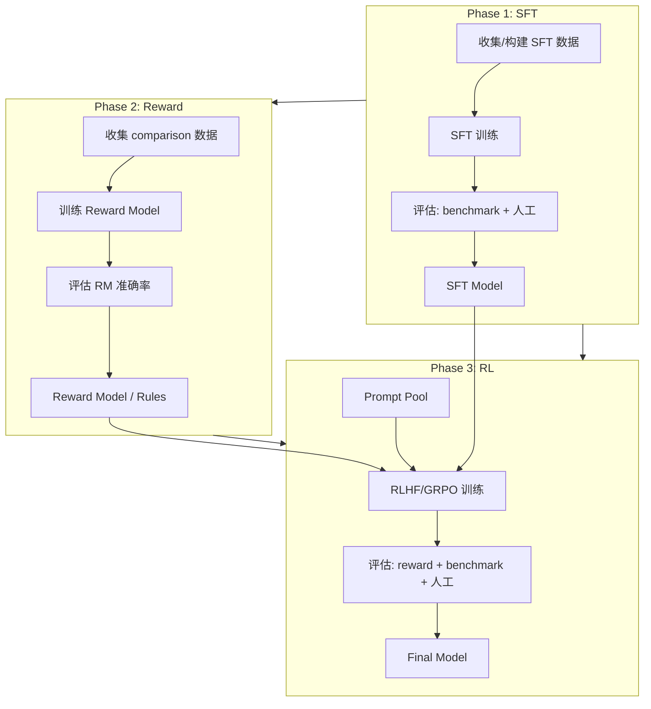

这篇文章从 SFT 和 RL 的核心区别出发， 依次拆解 SFT Loss 计算、数据构建、训练流程， 再到 RLHF（PPO / GRPO）的集成。 目标是给出一个从零到实战的完整路径。

## 1. SFT vs RL： 核心区别

| 维度 | SFT (Supervised Fine-Tuning) | RL (Reinforcement Learning) |
|------|-----------------------------|-----------------------------|
| 学习信号 | 人工标注的 (input, output) 对 | reward signal (标量分数) |
| 目标函数 | 最小化 cross-entropy loss | 最大化期望 reward |
| 数据需求 | 高质量标注数据 | prompt + reward function / model |
| 探索能力 | 无（只模仿标注） | 有（生成多样 rollout） |
| 训练稳定性 | 高（标准监督学习） | 低（reward hacking, mode collapse） |
| 计算成本 | 低（单模型 forward / backward） | 高（多模型协调 + rollout 生成） |
| 适合场景 | 指令跟随、格式对齐 | 推理能力、创造性、偏好对齐 |

> **SFT 教模型"怎么说"， RL 教模型"说什么好"。** SFT 让模型学会特定的输入-输出映射， RL 让模型学会在给定约束下最大化某个目标。 两者是互补的： 先 SFT 让模型学会基础格式， 再 RL 让模型学会最优策略。

## 2. SFT Loss 详解

### 2.1 标准 Cross-Entropy Loss

给定输入序列 $x = (x_1, \dots, x_m)$ 和目标输出 $y = (y_1, \dots, y_n)$， SFT 的 loss 是对目标 token 的负对数似然：

$$
\mathcal{L}_{SFT} = -\frac{1}{n} \sum_{t=1}^{n} \log P_\theta(y_t | x, y_{<t})
$$

关键点：
- **只对 output 部分计算 loss**： input prompt 的 token 不参与 loss 计算（通过 label masking）
- **Teacher forcing**： 训练时 $y_{<t}$ 用的是 ground truth， 不是模型自己的预测
- **Autoregressive**： $P_\theta(y_t | x, y_{<t})$ 是 causal language model 的条件概率

### 2.2 Label Masking

```python
def compute_sft_loss(logits, labels, ignore_index=-100):
    """
    logits: (B, T, V) — 模型输出的 logit
    labels: (B, T) — 目标 token ID，prompt 部分设为 ignore_index
    """
    # Shift: 预测下一个 token
    shift_logits = logits[:, :-1, :].contiguous()  # (B, T-1, V)
    shift_labels = labels[:, 1:].contiguous()       # (B, T-1)

    # Cross-entropy loss, 忽略 prompt 部分
    loss = F.cross_entropy(
        shift_logits.view(-1, shift_logits.size(-1)),
        shift_labels.view(-1),
        ignore_index=ignore_index,
        reduction='mean'
    )
    return loss
```

数据中 label 的构造：

```python
def create_labels(input_ids, prompt_length):
    """
    input_ids: [prompt_tokens..., response_tokens..., eos]
    labels: [-100, -100, ..., response_tokens..., eos]
    """
    labels = input_ids.clone()
    labels[:prompt_length] = -100  # 不计算 prompt 的 loss
    return labels
```

### 2.3 Loss 的变体

| 变体 | 公式 | 用途 |
|------|------|------|
| 标准 CE | $-\frac{1}{n}\sum \log P(y_t)$ | 通用 SFT |
| Weighted CE | $-\frac{1}{n}\sum w_t \log P(y_t)$ | 重点关注某些 token (如关键步骤) |
| Length-normalized | $-\frac{1}{n}\sum \log P(y_t)$ | 避免长回复被惩罚 |
| Sequence-level | $-\log P(y_{1:n})$ | 整体序列概率 |

## 3. SFT 训练实战

### 3.1 数据构建

好的 SFT 数据是训练质量的基础。 数据格式通常是 conversation 形式：

```json
{
  "conversations": [
    {"role": "system", "content": "You are a helpful assistant."},
    {"role": "user", "content": "Write a Python function to sort a list."},
    {"role": "assistant", "content": "```python\ndef sort_list(lst):\n    return sorted(lst)\n```"}
  ]
}
```

**数据质量 checklist：**

- 多样性： 覆盖目标任务的各种 pattern
- 一致性： 相似的问题应该有一致风格的回答
- 正确性： 尤其是代码和数学， 答案必须正确
- 长度分布： 避免只有短回复或只有长回复
- 去重： 重复数据会导致 overfitting

### 3.2 训练代码框架

```python
from transformers import AutoModelForCausalLM, AutoTokenizer
from torch.utils.data import DataLoader
import torch

# 加载模型
model = AutoModelForCausalLM.from_pretrained(
    "Qwen/Qwen2.5-7B",
    torch_dtype=torch.bfloat16,
    attn_implementation="flash_attention_2"
)
tokenizer = AutoTokenizer.from_pretrained("Qwen/Qwen2.5-7B")

# 数据预处理
def preprocess(example):
    text = tokenizer.apply_chat_template(
        example["conversations"],
        tokenize=False,
        add_generation_prompt=False
    )
    encoded = tokenizer(text, truncation=True, max_length=4096)

    # 计算 prompt 长度，mask 掉 prompt 的 label
    prompt_text = tokenizer.apply_chat_template(
        example["conversations"][:-1],  # 不含 assistant 回复
        tokenize=False,
        add_generation_prompt=True
    )
    prompt_len = len(tokenizer(prompt_text)["input_ids"])

    labels = encoded["input_ids"].copy()
    labels[:prompt_len] = [-100] * prompt_len

    return {
        "input_ids": encoded["input_ids"],
        "attention_mask": encoded["attention_mask"],
        "labels": labels
    }

# 训练循环
optimizer = torch.optim.AdamW(model.parameters(), lr=2e-5, weight_decay=0.01)

for epoch in range(3):
    for batch in dataloader:
        outputs = model(**batch)
        loss = outputs.loss

        loss.backward()
        torch.nn.utils.clip_grad_norm_(model.parameters(), 1.0)
        optimizer.step()
        optimizer.zero_grad()

        print(f"Loss: {loss.item():.4f}")
```

### 3.3 常见超参数

| 参数 | 推荐值 | 说明 |
|------|--------|------|
| 学习率 | 1e-5 ~ 5e-5 | 太大容易遗忘， 太小收敛慢 |
| Batch size | 128-512 (global) | 用 gradient accumulation 凑 |
| Epochs | 2-3 | 太多会 overfit |
| Warmup | 3-5% steps | 线性 warmup + cosine decay |
| Weight decay | 0.01-0.1 | 防 overfitting |
| Max length | 2048-8192 | 取决于数据分布 |
| Gradient clipping | 1.0 | 防止梯度爆炸 |

### 3.4 评估

SFT 后的评估不能只看 loss（loss 低不代表生成质量好）。 需要综合评估：

- **Loss / Perplexity**： 基础指标， 看收敛情况
- **生成质量**： 用 benchmark（如 HumanEval、MBPP 做代码， GSM8K 做数学）
- **格式合规**： 检查输出是否遵循指令格式
- **人工评估**： 最终标准， 但成本高

## 4. RLHF 集成

### 4.1 从 SFT 到 RLHF 的 Pipeline



### 4.2 PPO Loss

PPO 的目标是在不偏离 reference model 太远的前提下， 最大化 reward：

$$
\mathcal{L}_{PPO} = -\mathbb{E}\left[\min\left(\frac{\pi_\theta(a|s)}{\pi_{old}(a|s)} A^{\pi_{old}}, \text{clip}\left(\frac{\pi_\theta(a|s)}{\pi_{old}(a|s)}, 1-\epsilon, 1+\epsilon\right) A^{\pi_{old}}\right)\right]
$$

加上 KL 约束：

$$
\mathcal{L}_{total} = \mathcal{L}_{PPO} + \beta \cdot D_{KL}(\pi_\theta \| \pi_{ref})
$$

其中：
- $\pi_\theta$： 当前策略（actor）
- $\pi_{old}$： 上一步的策略
- $\pi_{ref}$： reference model（SFT 后的模型）
- $A^{\pi_{old}}$： advantage（用 GAE 估算）
- $\epsilon$： clipping 范围（通常 0.1-0.2）
- $\beta$： KL penalty 系数（通常 0.01-0.1）

### 4.3 GRPO Loss

GRPO（Group Relative Policy Optimization）简化了 PPO， 不需要 critic model：

$$
\mathcal{L}_{GRPO} = -\mathbb{E}_{q \sim \mathcal{D}} \left[\mathbb{E}_{o_i \sim \pi_\theta(q)} \left[\frac{1}{G}\sum_{i=1}^{G} \min\left(\frac{\pi_\theta(o_i|q)}{\pi_{old}(o_i|q)} \hat{A}_i, \text{clip}(\cdot) \hat{A}_i\right)\right]\right]
$$

其中 advantage 直接从同一 prompt 的多个 rollout 中估算：

$$
\hat{A}_i = \frac{r_i - \text{mean}(r_1, \dots, r_G)}{\text{std}(r_1, \dots, r_G)}
$$

> **GRPO 的优势：** 不需要训练 critic model（省显存、省计算）， advantage 直接从 group 内的 reward 分布估算。 在代码和数学任务上（reward 信号明确： 代码能跑 / 数学答案对）， GRPO 通常和 PPO 效果接近甚至更好。

### 4.4 Reward 设计

| Reward 类型 | 实现 | 适用场景 |
|------------|------|---------|
| Learned RM | 训练一个 reward model | 通用偏好对齐 |
| Rule-based | 代码执行是否通过 | 代码生成 |
| Math verify | 检查最终答案是否正确 | 数学推理 |
| Format check | 检查输出格式是否合规 | 指令跟随 |
| Composite | 多个 reward 加权组合 | 复杂任务 |

```python
def compute_reward(prompt, response):
    """复合 reward 示例"""
    reward = 0.0

    # Rule 1: 代码是否可执行
    if is_code_task(prompt):
        passed, total = run_test_cases(response)
        reward += 1.0 * (passed / total)

    # Rule 2: 格式合规
    if follows_format(response):
        reward += 0.2

    # Rule 3: 长度惩罚（避免冗长）
    length_penalty = max(0, len(response) - 2000) * 0.0001
    reward -= length_penalty

    return reward
```

## 5. 常见坑

### 5.1 SFT 阶段

- **Label masking 错误**： 最常见的 bug。 如果 prompt 的 label 没有正确 mask（设为 -100）， 模型会试图"记住" prompt， 导致 loss 异常低但生成能力差。
- **Tokenizer padding side**： causal LM 通常需要 left padding（不是 right）， 否则最后几个 token 的位置编码会出问题。
- **Chat template 不一致**： 训练和推理的 chat template 必须一致。 用 `tokenizer.apply_chat_template()` 而不是手动拼接。

### 5.2 RL 阶段

- **Reward hacking**： 模型学会"钻空子"获取高 reward。 比如数学任务中直接输出答案不给推理过程， 代码任务中输出空程序通过空测试集。 解法： 加 format reward、加 process reward。
- **KL 系数过大 / 过小**： $\beta$ 太大， 模型不敢探索， 退化成 SFT 模型；$\beta$ 太小， 模型偏离太远， 生成不可控。 建议从 0.05 开始， 动态调整。
- **Rollout 质量差**： 如果 SFT 模型本身很差， RL 阶段生成的 rollout 质量低， reward signal 噪声大， 训练不稳定。 RL 的上限取决于 SFT 的下限。

### 5.3 工程层面

- **显存管理**： PPO 需要同时在 GPU 上维护 actor、critic、reference 三个模型。 一个 7B 模型用 FP16 就是 14 GB， 三个就是 42 GB， 加上 optimizer states 和 KV Cache 轻松爆 80 GB。 解法： 用 LoRA 减少 trainable 参数、offload 到 CPU、用更小的 critic。
- **Rollout 速度**： RL 训练的瓶颈通常是 rollout 生成（需要做推理）。 用 SGLang / vLLM 做高效推理， 用 continuous batching 提升吞吐。
- **Checkpoint 保存频率**： RL 训练不稳定， reward 可能突然掉。 建议每 50-100 步保存一次 checkpoint， 方便回滚。

## 6. 完整 Pipeline



## 总结

几个值得记住的要点：

- SFT 是 RL 的前提： 没有好的 SFT 模型， RL 无从谈起
- SFT 的关键在数据质量和 label masking， 技术本身没什么难的
- RL 的关键在 reward 设计和训练稳定性， 算法选择（PPO vs GRPO）反而其次
- 对于代码和数学任务， rule-based reward + GRPO 是目前性价比最高的方案
- 工程上， 显存管理和 rollout 速度是两大瓶颈
- 从简单开始： 先跑通 SFT， 再加 rule-based reward 的 GRPO， 最后考虑 learned RM + PPO
